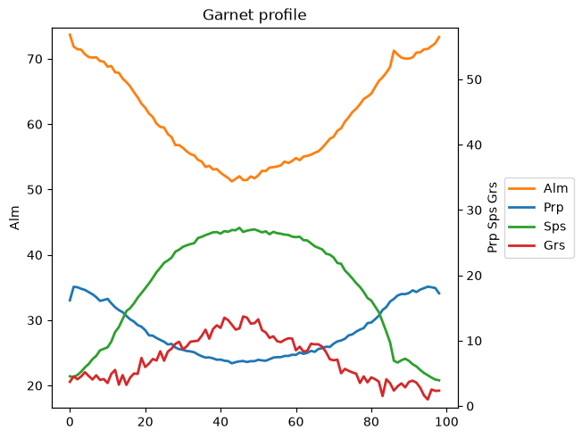
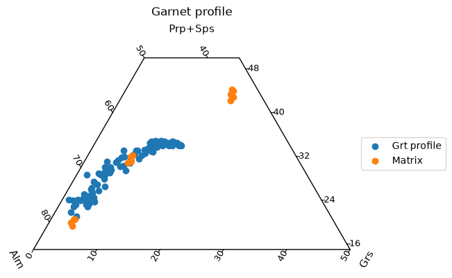
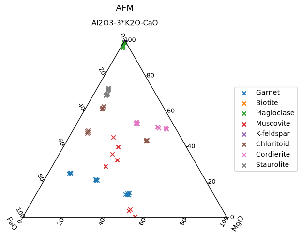
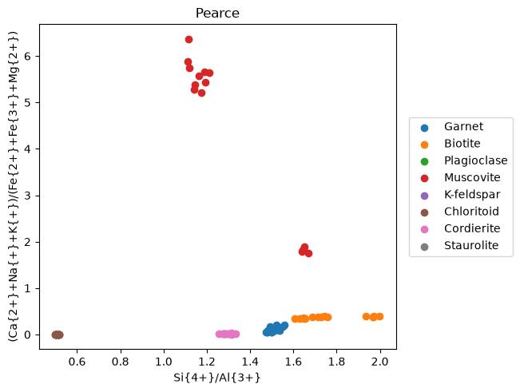

# Tutorial
Here we demonstrate the `petropandas` package. For simplicity, we will use star import.


```python
from petropandas import *
```

`petropandas` are designed as `pandas.DataFrame` accessors, so we need to create `pandas.DataFrame` before we can use it. There are several accessors available:

| Accessors | Description |
| --- | --- |
| **oxides**     | common calculations with oxides |
| **moles**      | convert to moles |
| **apfu**       | convert to cations |
| **mineral**    | working with mineral models |
| **bulk**       | working with bulk-rock composition |

Here we're using data from built-in examples, but you can read data from files, clipboard etc. For more details, check https://pandas.pydata.org/docs/reference/io.html


```python
from petropandas.data import minerals as df
from petropandas.data import grt_profile as pro
from petropandas.data import bulk as rock
```

## Basic usage

Let's see our dataframe...


```python
df
```


<div>
<style scoped>
    .dataframe tbody tr th:only-of-type {
        vertical-align: middle;
    }

    .dataframe tbody tr th {
        vertical-align: top;
    }

    .dataframe thead th {
        text-align: right;
    }
</style>
<table border="1" class="dataframe">
  <thead>
    <tr style="text-align: right;">
      <th></th>
      <th>Analysis_ID</th>
      <th>Mineral</th>
      <th>Subgroup</th>
      <th>SiO2</th>
      <th>TiO2</th>
      <th>Al2O3</th>
      <th>Cr2O3</th>
      <th>Fe2O3</th>
      <th>FeO</th>
      <th>MnO</th>
      <th>...</th>
      <th>CaO</th>
      <th>Na2O</th>
      <th>K2O</th>
      <th>ZnO</th>
      <th>F</th>
      <th>Cl</th>
      <th>Total</th>
      <th>Rock_Type</th>
      <th>Metamorphic_Grade</th>
      <th>Source</th>
    </tr>
  </thead>
  <tbody>
    <tr>
      <th>0</th>
      <td>GA-PEL-01</td>
      <td>Garnet</td>
      <td>Pelitic Schist</td>
      <td>37.10</td>
      <td>0.05</td>
      <td>21.47</td>
      <td>0.02</td>
      <td>0.19</td>
      <td>33.07</td>
      <td>3.33</td>
      <td>...</td>
      <td>1.47</td>
      <td>0.01</td>
      <td>0.01</td>
      <td>0.0</td>
      <td>0.0</td>
      <td>0.0</td>
      <td>99.87</td>
      <td>Pelitic Schist</td>
      <td>Amphibolite Facies</td>
      <td>Hollinetz et al. (2024) Eur. J. Mineral.</td>
    </tr>
    <tr>
      <th>1</th>
      <td>GA-PEL-02</td>
      <td>Garnet</td>
      <td>Pelitic Schist</td>
      <td>37.20</td>
      <td>0.04</td>
      <td>21.08</td>
      <td>0.02</td>
      <td>0.17</td>
      <td>33.42</td>
      <td>3.11</td>
      <td>...</td>
      <td>1.56</td>
      <td>0.01</td>
      <td>0.01</td>
      <td>0.0</td>
      <td>0.0</td>
      <td>0.0</td>
      <td>99.58</td>
      <td>Pelitic Schist</td>
      <td>Amphibolite Facies</td>
      <td>Hollinetz et al. (2024) Eur. J. Mineral.</td>
    </tr>
    <tr>
      <th>2</th>
      <td>GA-PEL-03</td>
      <td>Garnet</td>
      <td>Pelitic Schist</td>
      <td>36.96</td>
      <td>0.05</td>
      <td>21.23</td>
      <td>0.02</td>
      <td>0.18</td>
      <td>33.27</td>
      <td>3.14</td>
      <td>...</td>
      <td>1.50</td>
      <td>0.01</td>
      <td>0.01</td>
      <td>0.0</td>
      <td>0.0</td>
      <td>0.0</td>
      <td>99.64</td>
      <td>Pelitic Schist</td>
      <td>Amphibolite Facies</td>
      <td>Hollinetz et al. (2024) Eur. J. Mineral.</td>
    </tr>
    <tr>
      <th>3</th>
      <td>GA-PEL-04</td>
      <td>Garnet</td>
      <td>Pelitic Schist</td>
      <td>37.42</td>
      <td>0.04</td>
      <td>21.29</td>
      <td>0.02</td>
      <td>0.22</td>
      <td>33.58</td>
      <td>3.20</td>
      <td>...</td>
      <td>1.44</td>
      <td>0.01</td>
      <td>0.01</td>
      <td>0.0</td>
      <td>0.0</td>
      <td>0.0</td>
      <td>100.31</td>
      <td>Pelitic Schist</td>
      <td>Amphibolite Facies</td>
      <td>Hollinetz et al. (2024) Eur. J. Mineral.</td>
    </tr>
    <tr>
      <th>4</th>
      <td>GA-PEL-05</td>
      <td>Garnet</td>
      <td>Pelitic Schist</td>
      <td>37.17</td>
      <td>0.04</td>
      <td>21.48</td>
      <td>0.02</td>
      <td>0.18</td>
      <td>33.47</td>
      <td>3.29</td>
      <td>...</td>
      <td>1.46</td>
      <td>0.01</td>
      <td>0.01</td>
      <td>0.0</td>
      <td>0.0</td>
      <td>0.0</td>
      <td>100.30</td>
      <td>Pelitic Schist</td>
      <td>Amphibolite Facies</td>
      <td>Hollinetz et al. (2024) Eur. J. Mineral.</td>
    </tr>
    <tr>
      <th>...</th>
      <td>...</td>
      <td>...</td>
      <td>...</td>
      <td>...</td>
      <td>...</td>
      <td>...</td>
      <td>...</td>
      <td>...</td>
      <td>...</td>
      <td>...</td>
      <td>...</td>
      <td>...</td>
      <td>...</td>
      <td>...</td>
      <td>...</td>
      <td>...</td>
      <td>...</td>
      <td>...</td>
      <td>...</td>
      <td>...</td>
      <td>...</td>
    </tr>
    <tr>
      <th>310</th>
      <td>SA-HP -01</td>
      <td>Sapphirine</td>
      <td>HP Mg-Al Granulite</td>
      <td>12.27</td>
      <td>0.09</td>
      <td>65.23</td>
      <td>0.18</td>
      <td>0.44</td>
      <td>3.18</td>
      <td>0.03</td>
      <td>...</td>
      <td>0.02</td>
      <td>0.02</td>
      <td>0.01</td>
      <td>0.0</td>
      <td>0.0</td>
      <td>0.0</td>
      <td>99.84</td>
      <td>HP Pelitic Granulite</td>
      <td>Granulite Facies</td>
      <td>Kelsey &amp; Hand (2015) GSL Special Publ.</td>
    </tr>
    <tr>
      <th>311</th>
      <td>SA-HP -02</td>
      <td>Sapphirine</td>
      <td>HP Mg-Al Granulite</td>
      <td>13.14</td>
      <td>0.07</td>
      <td>64.93</td>
      <td>0.13</td>
      <td>0.46</td>
      <td>2.95</td>
      <td>0.03</td>
      <td>...</td>
      <td>0.02</td>
      <td>0.02</td>
      <td>0.01</td>
      <td>0.0</td>
      <td>0.0</td>
      <td>0.0</td>
      <td>99.66</td>
      <td>HP Pelitic Granulite</td>
      <td>Granulite Facies</td>
      <td>Kelsey &amp; Hand (2015) GSL Special Publ.</td>
    </tr>
    <tr>
      <th>312</th>
      <td>SA-HP -03</td>
      <td>Sapphirine</td>
      <td>HP Mg-Al Granulite</td>
      <td>12.48</td>
      <td>0.09</td>
      <td>64.78</td>
      <td>0.15</td>
      <td>0.37</td>
      <td>3.24</td>
      <td>0.02</td>
      <td>...</td>
      <td>0.02</td>
      <td>0.02</td>
      <td>0.01</td>
      <td>0.0</td>
      <td>0.0</td>
      <td>0.0</td>
      <td>99.79</td>
      <td>HP Pelitic Granulite</td>
      <td>Granulite Facies</td>
      <td>Kelsey &amp; Hand (2015) GSL Special Publ.</td>
    </tr>
    <tr>
      <th>313</th>
      <td>SA-HP -04</td>
      <td>Sapphirine</td>
      <td>HP Mg-Al Granulite</td>
      <td>12.67</td>
      <td>0.07</td>
      <td>65.07</td>
      <td>0.14</td>
      <td>0.42</td>
      <td>3.15</td>
      <td>0.03</td>
      <td>...</td>
      <td>0.02</td>
      <td>0.02</td>
      <td>0.01</td>
      <td>0.0</td>
      <td>0.0</td>
      <td>0.0</td>
      <td>99.64</td>
      <td>HP Pelitic Granulite</td>
      <td>Granulite Facies</td>
      <td>Kelsey &amp; Hand (2015) GSL Special Publ.</td>
    </tr>
    <tr>
      <th>314</th>
      <td>SA-HP -05</td>
      <td>Sapphirine</td>
      <td>HP Mg-Al Granulite</td>
      <td>13.16</td>
      <td>0.08</td>
      <td>65.42</td>
      <td>0.13</td>
      <td>0.42</td>
      <td>2.99</td>
      <td>0.03</td>
      <td>...</td>
      <td>0.02</td>
      <td>0.02</td>
      <td>0.01</td>
      <td>0.0</td>
      <td>0.0</td>
      <td>0.0</td>
      <td>100.36</td>
      <td>HP Pelitic Granulite</td>
      <td>Granulite Facies</td>
      <td>Kelsey &amp; Hand (2015) GSL Special Publ.</td>
    </tr>
  </tbody>
</table>
<p>315 rows × 21 columns</p>
</div>


The accessors `oxides`, `moles` and `apfu` are callable, and by default they return cleaned data.


```python
df.oxides()
```


<div>
<style scoped>
    .dataframe tbody tr th:only-of-type {
        vertical-align: middle;
    }

    .dataframe tbody tr th {
        vertical-align: top;
    }

    .dataframe thead th {
        text-align: right;
    }
</style>
<table border="1" class="dataframe">
  <thead>
    <tr style="text-align: right;">
      <th></th>
      <th>SiO2</th>
      <th>TiO2</th>
      <th>Al2O3</th>
      <th>Cr2O3</th>
      <th>Fe2O3</th>
      <th>FeO</th>
      <th>MnO</th>
      <th>MgO</th>
      <th>CaO</th>
      <th>Na2O</th>
      <th>K2O</th>
      <th>ZnO</th>
    </tr>
  </thead>
  <tbody>
    <tr>
      <th>0</th>
      <td>37.10</td>
      <td>0.05</td>
      <td>21.47</td>
      <td>0.02</td>
      <td>0.19</td>
      <td>33.07</td>
      <td>3.33</td>
      <td>3.15</td>
      <td>1.47</td>
      <td>0.01</td>
      <td>0.01</td>
      <td>0.0</td>
    </tr>
    <tr>
      <th>1</th>
      <td>37.20</td>
      <td>0.04</td>
      <td>21.08</td>
      <td>0.02</td>
      <td>0.17</td>
      <td>33.42</td>
      <td>3.11</td>
      <td>2.96</td>
      <td>1.56</td>
      <td>0.01</td>
      <td>0.01</td>
      <td>0.0</td>
    </tr>
    <tr>
      <th>2</th>
      <td>36.96</td>
      <td>0.05</td>
      <td>21.23</td>
      <td>0.02</td>
      <td>0.18</td>
      <td>33.27</td>
      <td>3.14</td>
      <td>3.27</td>
      <td>1.50</td>
      <td>0.01</td>
      <td>0.01</td>
      <td>0.0</td>
    </tr>
    <tr>
      <th>3</th>
      <td>37.42</td>
      <td>0.04</td>
      <td>21.29</td>
      <td>0.02</td>
      <td>0.22</td>
      <td>33.58</td>
      <td>3.20</td>
      <td>3.08</td>
      <td>1.44</td>
      <td>0.01</td>
      <td>0.01</td>
      <td>0.0</td>
    </tr>
    <tr>
      <th>4</th>
      <td>37.17</td>
      <td>0.04</td>
      <td>21.48</td>
      <td>0.02</td>
      <td>0.18</td>
      <td>33.47</td>
      <td>3.29</td>
      <td>3.17</td>
      <td>1.46</td>
      <td>0.01</td>
      <td>0.01</td>
      <td>0.0</td>
    </tr>
    <tr>
      <th>...</th>
      <td>...</td>
      <td>...</td>
      <td>...</td>
      <td>...</td>
      <td>...</td>
      <td>...</td>
      <td>...</td>
      <td>...</td>
      <td>...</td>
      <td>...</td>
      <td>...</td>
      <td>...</td>
    </tr>
    <tr>
      <th>310</th>
      <td>12.27</td>
      <td>0.09</td>
      <td>65.23</td>
      <td>0.18</td>
      <td>0.44</td>
      <td>3.18</td>
      <td>0.03</td>
      <td>18.37</td>
      <td>0.02</td>
      <td>0.02</td>
      <td>0.01</td>
      <td>0.0</td>
    </tr>
    <tr>
      <th>311</th>
      <td>13.14</td>
      <td>0.07</td>
      <td>64.93</td>
      <td>0.13</td>
      <td>0.46</td>
      <td>2.95</td>
      <td>0.03</td>
      <td>17.90</td>
      <td>0.02</td>
      <td>0.02</td>
      <td>0.01</td>
      <td>0.0</td>
    </tr>
    <tr>
      <th>312</th>
      <td>12.48</td>
      <td>0.09</td>
      <td>64.78</td>
      <td>0.15</td>
      <td>0.37</td>
      <td>3.24</td>
      <td>0.02</td>
      <td>18.61</td>
      <td>0.02</td>
      <td>0.02</td>
      <td>0.01</td>
      <td>0.0</td>
    </tr>
    <tr>
      <th>313</th>
      <td>12.67</td>
      <td>0.07</td>
      <td>65.07</td>
      <td>0.14</td>
      <td>0.42</td>
      <td>3.15</td>
      <td>0.03</td>
      <td>18.04</td>
      <td>0.02</td>
      <td>0.02</td>
      <td>0.01</td>
      <td>0.0</td>
    </tr>
    <tr>
      <th>314</th>
      <td>13.16</td>
      <td>0.08</td>
      <td>65.42</td>
      <td>0.13</td>
      <td>0.42</td>
      <td>2.99</td>
      <td>0.03</td>
      <td>18.08</td>
      <td>0.02</td>
      <td>0.02</td>
      <td>0.01</td>
      <td>0.0</td>
    </tr>
  </tbody>
</table>
<p>315 rows × 12 columns</p>
</div>


```python
df.moles()
```


<div>
<style scoped>
    .dataframe tbody tr th:only-of-type {
        vertical-align: middle;
    }

    .dataframe tbody tr th {
        vertical-align: top;
    }

    .dataframe thead th {
        text-align: right;
    }
</style>
<table border="1" class="dataframe">
  <thead>
    <tr style="text-align: right;">
      <th></th>
      <th>SiO2</th>
      <th>TiO2</th>
      <th>Al2O3</th>
      <th>Cr2O3</th>
      <th>Fe2O3</th>
      <th>FeO</th>
      <th>MnO</th>
      <th>MgO</th>
      <th>CaO</th>
      <th>Na2O</th>
      <th>K2O</th>
      <th>ZnO</th>
    </tr>
  </thead>
  <tbody>
    <tr>
      <th>0</th>
      <td>0.617479</td>
      <td>0.000626</td>
      <td>0.210573</td>
      <td>0.000132</td>
      <td>0.001190</td>
      <td>0.460303</td>
      <td>0.046943</td>
      <td>0.078156</td>
      <td>0.026214</td>
      <td>0.000161</td>
      <td>0.000106</td>
      <td>0.0</td>
    </tr>
    <tr>
      <th>1</th>
      <td>0.619144</td>
      <td>0.000501</td>
      <td>0.206748</td>
      <td>0.000132</td>
      <td>0.001065</td>
      <td>0.465175</td>
      <td>0.043842</td>
      <td>0.073442</td>
      <td>0.027819</td>
      <td>0.000161</td>
      <td>0.000106</td>
      <td>0.0</td>
    </tr>
    <tr>
      <th>2</th>
      <td>0.615149</td>
      <td>0.000626</td>
      <td>0.208219</td>
      <td>0.000132</td>
      <td>0.001127</td>
      <td>0.463087</td>
      <td>0.044265</td>
      <td>0.081133</td>
      <td>0.026749</td>
      <td>0.000161</td>
      <td>0.000106</td>
      <td>0.0</td>
    </tr>
    <tr>
      <th>3</th>
      <td>0.622805</td>
      <td>0.000501</td>
      <td>0.208807</td>
      <td>0.000132</td>
      <td>0.001378</td>
      <td>0.467402</td>
      <td>0.045110</td>
      <td>0.076419</td>
      <td>0.025679</td>
      <td>0.000161</td>
      <td>0.000106</td>
      <td>0.0</td>
    </tr>
    <tr>
      <th>4</th>
      <td>0.618644</td>
      <td>0.000501</td>
      <td>0.210671</td>
      <td>0.000132</td>
      <td>0.001127</td>
      <td>0.465870</td>
      <td>0.046379</td>
      <td>0.078652</td>
      <td>0.026036</td>
      <td>0.000161</td>
      <td>0.000106</td>
      <td>0.0</td>
    </tr>
    <tr>
      <th>...</th>
      <td>...</td>
      <td>...</td>
      <td>...</td>
      <td>...</td>
      <td>...</td>
      <td>...</td>
      <td>...</td>
      <td>...</td>
      <td>...</td>
      <td>...</td>
      <td>...</td>
      <td>...</td>
    </tr>
    <tr>
      <th>310</th>
      <td>0.204217</td>
      <td>0.001127</td>
      <td>0.639760</td>
      <td>0.001184</td>
      <td>0.002755</td>
      <td>0.044263</td>
      <td>0.000423</td>
      <td>0.455786</td>
      <td>0.000357</td>
      <td>0.000323</td>
      <td>0.000106</td>
      <td>0.0</td>
    </tr>
    <tr>
      <th>311</th>
      <td>0.218697</td>
      <td>0.000876</td>
      <td>0.636818</td>
      <td>0.000855</td>
      <td>0.002881</td>
      <td>0.041061</td>
      <td>0.000423</td>
      <td>0.444125</td>
      <td>0.000357</td>
      <td>0.000323</td>
      <td>0.000106</td>
      <td>0.0</td>
    </tr>
    <tr>
      <th>312</th>
      <td>0.207713</td>
      <td>0.001127</td>
      <td>0.635347</td>
      <td>0.000987</td>
      <td>0.002317</td>
      <td>0.045098</td>
      <td>0.000282</td>
      <td>0.461741</td>
      <td>0.000357</td>
      <td>0.000323</td>
      <td>0.000106</td>
      <td>0.0</td>
    </tr>
    <tr>
      <th>313</th>
      <td>0.210875</td>
      <td>0.000876</td>
      <td>0.638191</td>
      <td>0.000921</td>
      <td>0.002630</td>
      <td>0.043845</td>
      <td>0.000423</td>
      <td>0.447598</td>
      <td>0.000357</td>
      <td>0.000323</td>
      <td>0.000106</td>
      <td>0.0</td>
    </tr>
    <tr>
      <th>314</th>
      <td>0.219030</td>
      <td>0.001002</td>
      <td>0.641624</td>
      <td>0.000855</td>
      <td>0.002630</td>
      <td>0.041618</td>
      <td>0.000423</td>
      <td>0.448591</td>
      <td>0.000357</td>
      <td>0.000323</td>
      <td>0.000106</td>
      <td>0.0</td>
    </tr>
  </tbody>
</table>
<p>315 rows × 12 columns</p>
</div>


The accessor `oxides` provides several common utilities like `sorted`, `normalized`, `mean`, `split_valence`, `oxidize`, `reduce` or `select`. Here, we use the `select` to quickly select data of interest. Of course, any other standard `pandas` techniques could be used as well.

Let's select analyses of garnets identified by column `"Mineral"`.


```python
g = df.oxides.select("Garnet", on="Mineral")
g = g.oxides.sorted()
g
```


<div>
<style scoped>
    .dataframe tbody tr th:only-of-type {
        vertical-align: middle;
    }

    .dataframe tbody tr th {
        vertical-align: top;
    }

    .dataframe thead th {
        text-align: right;
    }
</style>
<table border="1" class="dataframe">
  <thead>
    <tr style="text-align: right;">
      <th></th>
      <th>SiO2</th>
      <th>TiO2</th>
      <th>Al2O3</th>
      <th>FeO</th>
      <th>Fe2O3</th>
      <th>MnO</th>
      <th>MgO</th>
      <th>CaO</th>
      <th>Na2O</th>
      <th>K2O</th>
      <th>Cr2O3</th>
      <th>ZnO</th>
    </tr>
  </thead>
  <tbody>
    <tr>
      <th>0</th>
      <td>37.10</td>
      <td>0.05</td>
      <td>21.47</td>
      <td>33.07</td>
      <td>0.19</td>
      <td>3.33</td>
      <td>3.15</td>
      <td>1.47</td>
      <td>0.01</td>
      <td>0.01</td>
      <td>0.02</td>
      <td>0.0</td>
    </tr>
    <tr>
      <th>1</th>
      <td>37.20</td>
      <td>0.04</td>
      <td>21.08</td>
      <td>33.42</td>
      <td>0.17</td>
      <td>3.11</td>
      <td>2.96</td>
      <td>1.56</td>
      <td>0.01</td>
      <td>0.01</td>
      <td>0.02</td>
      <td>0.0</td>
    </tr>
    <tr>
      <th>2</th>
      <td>36.96</td>
      <td>0.05</td>
      <td>21.23</td>
      <td>33.27</td>
      <td>0.18</td>
      <td>3.14</td>
      <td>3.27</td>
      <td>1.50</td>
      <td>0.01</td>
      <td>0.01</td>
      <td>0.02</td>
      <td>0.0</td>
    </tr>
    <tr>
      <th>3</th>
      <td>37.42</td>
      <td>0.04</td>
      <td>21.29</td>
      <td>33.58</td>
      <td>0.22</td>
      <td>3.20</td>
      <td>3.08</td>
      <td>1.44</td>
      <td>0.01</td>
      <td>0.01</td>
      <td>0.02</td>
      <td>0.0</td>
    </tr>
    <tr>
      <th>4</th>
      <td>37.17</td>
      <td>0.04</td>
      <td>21.48</td>
      <td>33.47</td>
      <td>0.18</td>
      <td>3.29</td>
      <td>3.17</td>
      <td>1.46</td>
      <td>0.01</td>
      <td>0.01</td>
      <td>0.02</td>
      <td>0.0</td>
    </tr>
    <tr>
      <th>5</th>
      <td>39.09</td>
      <td>0.08</td>
      <td>21.73</td>
      <td>19.35</td>
      <td>0.50</td>
      <td>0.25</td>
      <td>12.09</td>
      <td>7.24</td>
      <td>0.03</td>
      <td>0.01</td>
      <td>0.10</td>
      <td>0.0</td>
    </tr>
    <tr>
      <th>6</th>
      <td>39.67</td>
      <td>0.10</td>
      <td>21.62</td>
      <td>19.23</td>
      <td>0.46</td>
      <td>0.25</td>
      <td>11.15</td>
      <td>7.19</td>
      <td>0.03</td>
      <td>0.01</td>
      <td>0.14</td>
      <td>0.0</td>
    </tr>
    <tr>
      <th>7</th>
      <td>38.67</td>
      <td>0.07</td>
      <td>22.01</td>
      <td>19.05</td>
      <td>0.41</td>
      <td>0.25</td>
      <td>11.98</td>
      <td>6.96</td>
      <td>0.03</td>
      <td>0.01</td>
      <td>0.12</td>
      <td>0.0</td>
    </tr>
    <tr>
      <th>8</th>
      <td>39.50</td>
      <td>0.08</td>
      <td>22.03</td>
      <td>19.06</td>
      <td>0.35</td>
      <td>0.24</td>
      <td>11.48</td>
      <td>7.14</td>
      <td>0.03</td>
      <td>0.01</td>
      <td>0.12</td>
      <td>0.0</td>
    </tr>
    <tr>
      <th>9</th>
      <td>39.31</td>
      <td>0.08</td>
      <td>21.51</td>
      <td>19.53</td>
      <td>0.45</td>
      <td>0.24</td>
      <td>11.82</td>
      <td>7.14</td>
      <td>0.02</td>
      <td>0.01</td>
      <td>0.12</td>
      <td>0.0</td>
    </tr>
    <tr>
      <th>10</th>
      <td>38.03</td>
      <td>0.05</td>
      <td>21.78</td>
      <td>28.69</td>
      <td>0.32</td>
      <td>0.71</td>
      <td>7.55</td>
      <td>2.87</td>
      <td>0.01</td>
      <td>0.01</td>
      <td>0.01</td>
      <td>0.0</td>
    </tr>
    <tr>
      <th>11</th>
      <td>38.05</td>
      <td>0.06</td>
      <td>21.69</td>
      <td>28.52</td>
      <td>0.27</td>
      <td>0.96</td>
      <td>7.54</td>
      <td>2.93</td>
      <td>0.01</td>
      <td>0.01</td>
      <td>0.01</td>
      <td>0.0</td>
    </tr>
    <tr>
      <th>12</th>
      <td>38.11</td>
      <td>0.07</td>
      <td>21.37</td>
      <td>28.37</td>
      <td>0.32</td>
      <td>0.88</td>
      <td>7.82</td>
      <td>2.82</td>
      <td>0.01</td>
      <td>0.01</td>
      <td>0.01</td>
      <td>0.0</td>
    </tr>
    <tr>
      <th>13</th>
      <td>38.76</td>
      <td>0.06</td>
      <td>21.40</td>
      <td>28.54</td>
      <td>0.25</td>
      <td>0.99</td>
      <td>7.56</td>
      <td>2.96</td>
      <td>0.01</td>
      <td>0.01</td>
      <td>0.01</td>
      <td>0.0</td>
    </tr>
    <tr>
      <th>14</th>
      <td>38.30</td>
      <td>0.05</td>
      <td>21.66</td>
      <td>28.67</td>
      <td>0.30</td>
      <td>0.89</td>
      <td>8.01</td>
      <td>2.91</td>
      <td>0.01</td>
      <td>0.01</td>
      <td>0.01</td>
      <td>0.0</td>
    </tr>
  </tbody>
</table>
</div>


Analyses could be converted to cations p.f.u, either providing number of oxygens:


```python
g.apfu(n_oxygens=12)
```


<div>
<style scoped>
    .dataframe tbody tr th:only-of-type {
        vertical-align: middle;
    }

    .dataframe tbody tr th {
        vertical-align: top;
    }

    .dataframe thead th {
        text-align: right;
    }
</style>
<table border="1" class="dataframe">
  <thead>
    <tr style="text-align: right;">
      <th></th>
      <th>Si{4+}</th>
      <th>Ti{4+}</th>
      <th>Al{3+}</th>
      <th>Fe{2+}</th>
      <th>Fe{3+}</th>
      <th>Mn{2+}</th>
      <th>Mg{2+}</th>
      <th>Ca{2+}</th>
      <th>Na{+}</th>
      <th>K{+}</th>
      <th>Cr{3+}</th>
      <th>Zn{2+}</th>
    </tr>
  </thead>
  <tbody>
    <tr>
      <th>0</th>
      <td>2.983260</td>
      <td>0.003025</td>
      <td>2.034702</td>
      <td>2.223886</td>
      <td>0.011497</td>
      <td>0.226798</td>
      <td>0.377599</td>
      <td>0.126649</td>
      <td>0.001559</td>
      <td>0.001026</td>
      <td>0.001271</td>
      <td>0.0</td>
    </tr>
    <tr>
      <th>1</th>
      <td>3.003529</td>
      <td>0.002430</td>
      <td>2.005907</td>
      <td>2.256609</td>
      <td>0.010329</td>
      <td>0.212681</td>
      <td>0.356274</td>
      <td>0.134952</td>
      <td>0.001565</td>
      <td>0.001030</td>
      <td>0.001277</td>
      <td>0.0</td>
    </tr>
    <tr>
      <th>2</th>
      <td>2.981958</td>
      <td>0.003035</td>
      <td>2.018696</td>
      <td>2.244830</td>
      <td>0.010928</td>
      <td>0.214574</td>
      <td>0.393297</td>
      <td>0.129666</td>
      <td>0.001564</td>
      <td>0.001029</td>
      <td>0.001276</td>
      <td>0.0</td>
    </tr>
    <tr>
      <th>3</th>
      <td>2.998533</td>
      <td>0.002411</td>
      <td>2.010630</td>
      <td>2.250333</td>
      <td>0.013266</td>
      <td>0.217187</td>
      <td>0.367925</td>
      <td>0.123633</td>
      <td>0.001554</td>
      <td>0.001022</td>
      <td>0.001267</td>
      <td>0.0</td>
    </tr>
    <tr>
      <th>4</th>
      <td>2.979882</td>
      <td>0.002412</td>
      <td>2.029515</td>
      <td>2.244002</td>
      <td>0.010859</td>
      <td>0.223399</td>
      <td>0.378852</td>
      <td>0.125408</td>
      <td>0.001554</td>
      <td>0.001023</td>
      <td>0.001268</td>
      <td>0.0</td>
    </tr>
    <tr>
      <th>5</th>
      <td>2.938943</td>
      <td>0.004525</td>
      <td>1.925470</td>
      <td>1.216656</td>
      <td>0.028288</td>
      <td>0.015920</td>
      <td>1.355050</td>
      <td>0.583218</td>
      <td>0.004373</td>
      <td>0.000959</td>
      <td>0.005944</td>
      <td>0.0</td>
    </tr>
    <tr>
      <th>6</th>
      <td>2.993001</td>
      <td>0.005676</td>
      <td>1.922436</td>
      <td>1.213347</td>
      <td>0.026116</td>
      <td>0.015976</td>
      <td>1.254073</td>
      <td>0.581220</td>
      <td>0.004388</td>
      <td>0.000962</td>
      <td>0.008351</td>
      <td>0.0</td>
    </tr>
    <tr>
      <th>7</th>
      <td>2.928518</td>
      <td>0.003988</td>
      <td>1.964469</td>
      <td>1.206507</td>
      <td>0.023365</td>
      <td>0.016036</td>
      <td>1.352490</td>
      <td>0.564742</td>
      <td>0.004405</td>
      <td>0.000966</td>
      <td>0.007185</td>
      <td>0.0</td>
    </tr>
    <tr>
      <th>8</th>
      <td>2.970937</td>
      <td>0.004527</td>
      <td>1.952820</td>
      <td>1.198893</td>
      <td>0.019810</td>
      <td>0.015289</td>
      <td>1.287187</td>
      <td>0.575389</td>
      <td>0.004375</td>
      <td>0.000960</td>
      <td>0.007136</td>
      <td>0.0</td>
    </tr>
    <tr>
      <th>9</th>
      <td>2.962145</td>
      <td>0.004535</td>
      <td>1.910272</td>
      <td>1.230741</td>
      <td>0.025517</td>
      <td>0.015318</td>
      <td>1.327774</td>
      <td>0.576459</td>
      <td>0.002922</td>
      <td>0.000961</td>
      <td>0.007149</td>
      <td>0.0</td>
    </tr>
    <tr>
      <th>10</th>
      <td>2.964285</td>
      <td>0.002932</td>
      <td>2.000797</td>
      <td>1.870188</td>
      <td>0.018770</td>
      <td>0.046874</td>
      <td>0.877292</td>
      <td>0.239686</td>
      <td>0.001511</td>
      <td>0.000994</td>
      <td>0.000616</td>
      <td>0.0</td>
    </tr>
    <tr>
      <th>11</th>
      <td>2.966644</td>
      <td>0.003519</td>
      <td>1.993067</td>
      <td>1.859608</td>
      <td>0.015841</td>
      <td>0.063396</td>
      <td>0.876366</td>
      <td>0.244763</td>
      <td>0.001512</td>
      <td>0.000995</td>
      <td>0.000616</td>
      <td>0.0</td>
    </tr>
    <tr>
      <th>12</th>
      <td>2.976503</td>
      <td>0.004113</td>
      <td>1.967086</td>
      <td>1.853053</td>
      <td>0.018807</td>
      <td>0.058214</td>
      <td>0.910495</td>
      <td>0.235984</td>
      <td>0.001514</td>
      <td>0.000996</td>
      <td>0.000617</td>
      <td>0.0</td>
    </tr>
    <tr>
      <th>13</th>
      <td>3.002709</td>
      <td>0.003497</td>
      <td>1.953866</td>
      <td>1.849033</td>
      <td>0.014574</td>
      <td>0.064960</td>
      <td>0.873081</td>
      <td>0.245690</td>
      <td>0.001502</td>
      <td>0.000988</td>
      <td>0.000612</td>
      <td>0.0</td>
    </tr>
    <tr>
      <th>14</th>
      <td>2.962821</td>
      <td>0.002910</td>
      <td>1.974770</td>
      <td>1.854793</td>
      <td>0.017464</td>
      <td>0.058314</td>
      <td>0.923725</td>
      <td>0.241194</td>
      <td>0.001500</td>
      <td>0.000987</td>
      <td>0.000612</td>
      <td>0.0</td>
    </tr>
  </tbody>
</table>
</div>


or number of cations:


```python
g.apfu(n_cations=8)
```


<div>
<style scoped>
    .dataframe tbody tr th:only-of-type {
        vertical-align: middle;
    }

    .dataframe tbody tr th {
        vertical-align: top;
    }

    .dataframe thead th {
        text-align: right;
    }
</style>
<table border="1" class="dataframe">
  <thead>
    <tr style="text-align: right;">
      <th></th>
      <th>Si{4+}</th>
      <th>Ti{4+}</th>
      <th>Al{3+}</th>
      <th>Fe{2+}</th>
      <th>Fe{3+}</th>
      <th>Mn{2+}</th>
      <th>Mg{2+}</th>
      <th>Ca{2+}</th>
      <th>Na{+}</th>
      <th>K{+}</th>
      <th>Cr{3+}</th>
      <th>Zn{2+}</th>
    </tr>
  </thead>
  <tbody>
    <tr>
      <th>0</th>
      <td>2.986518</td>
      <td>0.003028</td>
      <td>2.036924</td>
      <td>2.226315</td>
      <td>0.011510</td>
      <td>0.227046</td>
      <td>0.378012</td>
      <td>0.126787</td>
      <td>0.001561</td>
      <td>0.001027</td>
      <td>0.001273</td>
      <td>0.0</td>
    </tr>
    <tr>
      <th>1</th>
      <td>3.008574</td>
      <td>0.002434</td>
      <td>2.009277</td>
      <td>2.260400</td>
      <td>0.010346</td>
      <td>0.213038</td>
      <td>0.356872</td>
      <td>0.135179</td>
      <td>0.001568</td>
      <td>0.001032</td>
      <td>0.001279</td>
      <td>0.0</td>
    </tr>
    <tr>
      <th>2</th>
      <td>2.981639</td>
      <td>0.003035</td>
      <td>2.018481</td>
      <td>2.244590</td>
      <td>0.010927</td>
      <td>0.214551</td>
      <td>0.393255</td>
      <td>0.129653</td>
      <td>0.001564</td>
      <td>0.001029</td>
      <td>0.001276</td>
      <td>0.0</td>
    </tr>
    <tr>
      <th>3</th>
      <td>3.003127</td>
      <td>0.002415</td>
      <td>2.013711</td>
      <td>2.253781</td>
      <td>0.013286</td>
      <td>0.217520</td>
      <td>0.368489</td>
      <td>0.123822</td>
      <td>0.001556</td>
      <td>0.001024</td>
      <td>0.001269</td>
      <td>0.0</td>
    </tr>
    <tr>
      <th>4</th>
      <td>2.980562</td>
      <td>0.002413</td>
      <td>2.029978</td>
      <td>2.244515</td>
      <td>0.010862</td>
      <td>0.223450</td>
      <td>0.378938</td>
      <td>0.125437</td>
      <td>0.001555</td>
      <td>0.001023</td>
      <td>0.001268</td>
      <td>0.0</td>
    </tr>
    <tr>
      <th>5</th>
      <td>2.910080</td>
      <td>0.004480</td>
      <td>1.906560</td>
      <td>1.204707</td>
      <td>0.028011</td>
      <td>0.015764</td>
      <td>1.341742</td>
      <td>0.577490</td>
      <td>0.004330</td>
      <td>0.000950</td>
      <td>0.005886</td>
      <td>0.0</td>
    </tr>
    <tr>
      <th>6</th>
      <td>2.983474</td>
      <td>0.005658</td>
      <td>1.916316</td>
      <td>1.209485</td>
      <td>0.026033</td>
      <td>0.015925</td>
      <td>1.250081</td>
      <td>0.579370</td>
      <td>0.004374</td>
      <td>0.000959</td>
      <td>0.008324</td>
      <td>0.0</td>
    </tr>
    <tr>
      <th>7</th>
      <td>2.902155</td>
      <td>0.003952</td>
      <td>1.946785</td>
      <td>1.195646</td>
      <td>0.023155</td>
      <td>0.015892</td>
      <td>1.340315</td>
      <td>0.559658</td>
      <td>0.004365</td>
      <td>0.000957</td>
      <td>0.007120</td>
      <td>0.0</td>
    </tr>
    <tr>
      <th>8</th>
      <td>2.957141</td>
      <td>0.004506</td>
      <td>1.943752</td>
      <td>1.193326</td>
      <td>0.019718</td>
      <td>0.015218</td>
      <td>1.281210</td>
      <td>0.572717</td>
      <td>0.004354</td>
      <td>0.000955</td>
      <td>0.007103</td>
      <td>0.0</td>
    </tr>
    <tr>
      <th>9</th>
      <td>2.938712</td>
      <td>0.004499</td>
      <td>1.895160</td>
      <td>1.221004</td>
      <td>0.025315</td>
      <td>0.015197</td>
      <td>1.317270</td>
      <td>0.571899</td>
      <td>0.002899</td>
      <td>0.000954</td>
      <td>0.007093</td>
      <td>0.0</td>
    </tr>
    <tr>
      <th>10</th>
      <td>2.955439</td>
      <td>0.002923</td>
      <td>1.994826</td>
      <td>1.864607</td>
      <td>0.018714</td>
      <td>0.046734</td>
      <td>0.874674</td>
      <td>0.238971</td>
      <td>0.001507</td>
      <td>0.000991</td>
      <td>0.000614</td>
      <td>0.0</td>
    </tr>
    <tr>
      <th>11</th>
      <td>2.956913</td>
      <td>0.003508</td>
      <td>1.986529</td>
      <td>1.853508</td>
      <td>0.015789</td>
      <td>0.063188</td>
      <td>0.873492</td>
      <td>0.243960</td>
      <td>0.001507</td>
      <td>0.000991</td>
      <td>0.000614</td>
      <td>0.0</td>
    </tr>
    <tr>
      <th>12</th>
      <td>2.966349</td>
      <td>0.004099</td>
      <td>1.960376</td>
      <td>1.846732</td>
      <td>0.018743</td>
      <td>0.058016</td>
      <td>0.907389</td>
      <td>0.235179</td>
      <td>0.001509</td>
      <td>0.000993</td>
      <td>0.000615</td>
      <td>0.0</td>
    </tr>
    <tr>
      <th>13</th>
      <td>2.998769</td>
      <td>0.003492</td>
      <td>1.951302</td>
      <td>1.846606</td>
      <td>0.014555</td>
      <td>0.064874</td>
      <td>0.871936</td>
      <td>0.245368</td>
      <td>0.001500</td>
      <td>0.000987</td>
      <td>0.000612</td>
      <td>0.0</td>
    </tr>
    <tr>
      <th>14</th>
      <td>2.948415</td>
      <td>0.002896</td>
      <td>1.965168</td>
      <td>1.845774</td>
      <td>0.017379</td>
      <td>0.058031</td>
      <td>0.919233</td>
      <td>0.240021</td>
      <td>0.001493</td>
      <td>0.000982</td>
      <td>0.000609</td>
      <td>0.0</td>
    </tr>
  </tbody>
</table>
</div>


The `split_valence` method could be used to split low and high valency for selected elements e.g. Fe³⁺/Fe²⁺ using Droop (1987) and Schumacher (1991) methods.


```python
g.oxides.split_valence("Fe", "droop", 12, 8)
```


<div>
<style scoped>
    .dataframe tbody tr th:only-of-type {
        vertical-align: middle;
    }

    .dataframe tbody tr th {
        vertical-align: top;
    }

    .dataframe thead th {
        text-align: right;
    }
</style>
<table border="1" class="dataframe">
  <thead>
    <tr style="text-align: right;">
      <th></th>
      <th>SiO2</th>
      <th>TiO2</th>
      <th>Al2O3</th>
      <th>FeO</th>
      <th>Fe2O3</th>
      <th>MnO</th>
      <th>MgO</th>
      <th>CaO</th>
      <th>Na2O</th>
      <th>K2O</th>
      <th>Cr2O3</th>
      <th>ZnO</th>
    </tr>
  </thead>
  <tbody>
    <tr>
      <th>0</th>
      <td>37.10</td>
      <td>0.05</td>
      <td>21.47</td>
      <td>33.07</td>
      <td>0.19</td>
      <td>3.33</td>
      <td>3.15</td>
      <td>1.47</td>
      <td>0.01</td>
      <td>0.01</td>
      <td>0.02</td>
      <td>0.0</td>
    </tr>
    <tr>
      <th>1</th>
      <td>37.20</td>
      <td>0.04</td>
      <td>21.08</td>
      <td>33.42</td>
      <td>0.17</td>
      <td>3.11</td>
      <td>2.96</td>
      <td>1.56</td>
      <td>0.01</td>
      <td>0.01</td>
      <td>0.02</td>
      <td>0.0</td>
    </tr>
    <tr>
      <th>2</th>
      <td>36.96</td>
      <td>0.05</td>
      <td>21.23</td>
      <td>33.27</td>
      <td>0.18</td>
      <td>3.14</td>
      <td>3.27</td>
      <td>1.50</td>
      <td>0.01</td>
      <td>0.01</td>
      <td>0.02</td>
      <td>0.0</td>
    </tr>
    <tr>
      <th>3</th>
      <td>37.42</td>
      <td>0.04</td>
      <td>21.29</td>
      <td>33.58</td>
      <td>0.22</td>
      <td>3.20</td>
      <td>3.08</td>
      <td>1.44</td>
      <td>0.01</td>
      <td>0.01</td>
      <td>0.02</td>
      <td>0.0</td>
    </tr>
    <tr>
      <th>4</th>
      <td>37.17</td>
      <td>0.04</td>
      <td>21.48</td>
      <td>33.47</td>
      <td>0.18</td>
      <td>3.29</td>
      <td>3.17</td>
      <td>1.46</td>
      <td>0.01</td>
      <td>0.01</td>
      <td>0.02</td>
      <td>0.0</td>
    </tr>
    <tr>
      <th>5</th>
      <td>39.09</td>
      <td>0.08</td>
      <td>21.73</td>
      <td>19.35</td>
      <td>0.50</td>
      <td>0.25</td>
      <td>12.09</td>
      <td>7.24</td>
      <td>0.03</td>
      <td>0.01</td>
      <td>0.10</td>
      <td>0.0</td>
    </tr>
    <tr>
      <th>6</th>
      <td>39.67</td>
      <td>0.10</td>
      <td>21.62</td>
      <td>19.23</td>
      <td>0.46</td>
      <td>0.25</td>
      <td>11.15</td>
      <td>7.19</td>
      <td>0.03</td>
      <td>0.01</td>
      <td>0.14</td>
      <td>0.0</td>
    </tr>
    <tr>
      <th>7</th>
      <td>38.67</td>
      <td>0.07</td>
      <td>22.01</td>
      <td>19.05</td>
      <td>0.41</td>
      <td>0.25</td>
      <td>11.98</td>
      <td>6.96</td>
      <td>0.03</td>
      <td>0.01</td>
      <td>0.12</td>
      <td>0.0</td>
    </tr>
    <tr>
      <th>8</th>
      <td>39.50</td>
      <td>0.08</td>
      <td>22.03</td>
      <td>19.06</td>
      <td>0.35</td>
      <td>0.24</td>
      <td>11.48</td>
      <td>7.14</td>
      <td>0.03</td>
      <td>0.01</td>
      <td>0.12</td>
      <td>0.0</td>
    </tr>
    <tr>
      <th>9</th>
      <td>39.31</td>
      <td>0.08</td>
      <td>21.51</td>
      <td>19.53</td>
      <td>0.45</td>
      <td>0.24</td>
      <td>11.82</td>
      <td>7.14</td>
      <td>0.02</td>
      <td>0.01</td>
      <td>0.12</td>
      <td>0.0</td>
    </tr>
    <tr>
      <th>10</th>
      <td>38.03</td>
      <td>0.05</td>
      <td>21.78</td>
      <td>28.69</td>
      <td>0.32</td>
      <td>0.71</td>
      <td>7.55</td>
      <td>2.87</td>
      <td>0.01</td>
      <td>0.01</td>
      <td>0.01</td>
      <td>0.0</td>
    </tr>
    <tr>
      <th>11</th>
      <td>38.05</td>
      <td>0.06</td>
      <td>21.69</td>
      <td>28.52</td>
      <td>0.27</td>
      <td>0.96</td>
      <td>7.54</td>
      <td>2.93</td>
      <td>0.01</td>
      <td>0.01</td>
      <td>0.01</td>
      <td>0.0</td>
    </tr>
    <tr>
      <th>12</th>
      <td>38.11</td>
      <td>0.07</td>
      <td>21.37</td>
      <td>28.37</td>
      <td>0.32</td>
      <td>0.88</td>
      <td>7.82</td>
      <td>2.82</td>
      <td>0.01</td>
      <td>0.01</td>
      <td>0.01</td>
      <td>0.0</td>
    </tr>
    <tr>
      <th>13</th>
      <td>38.76</td>
      <td>0.06</td>
      <td>21.40</td>
      <td>28.54</td>
      <td>0.25</td>
      <td>0.99</td>
      <td>7.56</td>
      <td>2.96</td>
      <td>0.01</td>
      <td>0.01</td>
      <td>0.01</td>
      <td>0.0</td>
    </tr>
    <tr>
      <th>14</th>
      <td>38.30</td>
      <td>0.05</td>
      <td>21.66</td>
      <td>28.67</td>
      <td>0.30</td>
      <td>0.89</td>
      <td>8.01</td>
      <td>2.91</td>
      <td>0.01</td>
      <td>0.01</td>
      <td>0.01</td>
      <td>0.0</td>
    </tr>
  </tbody>
</table>
</div>


```python
g.oxides.split_valence("Fe", "schumacher", 12, 8)
```


<div>
<style scoped>
    .dataframe tbody tr th:only-of-type {
        vertical-align: middle;
    }

    .dataframe tbody tr th {
        vertical-align: top;
    }

    .dataframe thead th {
        text-align: right;
    }
</style>
<table border="1" class="dataframe">
  <thead>
    <tr style="text-align: right;">
      <th></th>
      <th>SiO2</th>
      <th>TiO2</th>
      <th>Al2O3</th>
      <th>FeO</th>
      <th>Fe2O3</th>
      <th>MnO</th>
      <th>MgO</th>
      <th>CaO</th>
      <th>Na2O</th>
      <th>K2O</th>
      <th>Cr2O3</th>
      <th>ZnO</th>
    </tr>
  </thead>
  <tbody>
    <tr>
      <th>0</th>
      <td>37.10</td>
      <td>0.05</td>
      <td>21.47</td>
      <td>33.07</td>
      <td>0.19</td>
      <td>3.33</td>
      <td>3.15</td>
      <td>1.47</td>
      <td>0.01</td>
      <td>0.01</td>
      <td>0.02</td>
      <td>0.0</td>
    </tr>
    <tr>
      <th>1</th>
      <td>37.20</td>
      <td>0.04</td>
      <td>21.08</td>
      <td>33.42</td>
      <td>0.17</td>
      <td>3.11</td>
      <td>2.96</td>
      <td>1.56</td>
      <td>0.01</td>
      <td>0.01</td>
      <td>0.02</td>
      <td>0.0</td>
    </tr>
    <tr>
      <th>2</th>
      <td>36.96</td>
      <td>0.05</td>
      <td>21.23</td>
      <td>33.27</td>
      <td>0.18</td>
      <td>3.14</td>
      <td>3.27</td>
      <td>1.50</td>
      <td>0.01</td>
      <td>0.01</td>
      <td>0.02</td>
      <td>0.0</td>
    </tr>
    <tr>
      <th>3</th>
      <td>37.42</td>
      <td>0.04</td>
      <td>21.29</td>
      <td>33.58</td>
      <td>0.22</td>
      <td>3.20</td>
      <td>3.08</td>
      <td>1.44</td>
      <td>0.01</td>
      <td>0.01</td>
      <td>0.02</td>
      <td>0.0</td>
    </tr>
    <tr>
      <th>4</th>
      <td>37.17</td>
      <td>0.04</td>
      <td>21.48</td>
      <td>33.47</td>
      <td>0.18</td>
      <td>3.29</td>
      <td>3.17</td>
      <td>1.46</td>
      <td>0.01</td>
      <td>0.01</td>
      <td>0.02</td>
      <td>0.0</td>
    </tr>
    <tr>
      <th>5</th>
      <td>39.09</td>
      <td>0.08</td>
      <td>21.73</td>
      <td>19.35</td>
      <td>0.50</td>
      <td>0.25</td>
      <td>12.09</td>
      <td>7.24</td>
      <td>0.03</td>
      <td>0.01</td>
      <td>0.10</td>
      <td>0.0</td>
    </tr>
    <tr>
      <th>6</th>
      <td>39.67</td>
      <td>0.10</td>
      <td>21.62</td>
      <td>19.23</td>
      <td>0.46</td>
      <td>0.25</td>
      <td>11.15</td>
      <td>7.19</td>
      <td>0.03</td>
      <td>0.01</td>
      <td>0.14</td>
      <td>0.0</td>
    </tr>
    <tr>
      <th>7</th>
      <td>38.67</td>
      <td>0.07</td>
      <td>22.01</td>
      <td>19.05</td>
      <td>0.41</td>
      <td>0.25</td>
      <td>11.98</td>
      <td>6.96</td>
      <td>0.03</td>
      <td>0.01</td>
      <td>0.12</td>
      <td>0.0</td>
    </tr>
    <tr>
      <th>8</th>
      <td>39.50</td>
      <td>0.08</td>
      <td>22.03</td>
      <td>19.06</td>
      <td>0.35</td>
      <td>0.24</td>
      <td>11.48</td>
      <td>7.14</td>
      <td>0.03</td>
      <td>0.01</td>
      <td>0.12</td>
      <td>0.0</td>
    </tr>
    <tr>
      <th>9</th>
      <td>39.31</td>
      <td>0.08</td>
      <td>21.51</td>
      <td>19.53</td>
      <td>0.45</td>
      <td>0.24</td>
      <td>11.82</td>
      <td>7.14</td>
      <td>0.02</td>
      <td>0.01</td>
      <td>0.12</td>
      <td>0.0</td>
    </tr>
    <tr>
      <th>10</th>
      <td>38.03</td>
      <td>0.05</td>
      <td>21.78</td>
      <td>28.69</td>
      <td>0.32</td>
      <td>0.71</td>
      <td>7.55</td>
      <td>2.87</td>
      <td>0.01</td>
      <td>0.01</td>
      <td>0.01</td>
      <td>0.0</td>
    </tr>
    <tr>
      <th>11</th>
      <td>38.05</td>
      <td>0.06</td>
      <td>21.69</td>
      <td>28.52</td>
      <td>0.27</td>
      <td>0.96</td>
      <td>7.54</td>
      <td>2.93</td>
      <td>0.01</td>
      <td>0.01</td>
      <td>0.01</td>
      <td>0.0</td>
    </tr>
    <tr>
      <th>12</th>
      <td>38.11</td>
      <td>0.07</td>
      <td>21.37</td>
      <td>28.37</td>
      <td>0.32</td>
      <td>0.88</td>
      <td>7.82</td>
      <td>2.82</td>
      <td>0.01</td>
      <td>0.01</td>
      <td>0.01</td>
      <td>0.0</td>
    </tr>
    <tr>
      <th>13</th>
      <td>38.76</td>
      <td>0.06</td>
      <td>21.40</td>
      <td>28.54</td>
      <td>0.25</td>
      <td>0.99</td>
      <td>7.56</td>
      <td>2.96</td>
      <td>0.01</td>
      <td>0.01</td>
      <td>0.01</td>
      <td>0.0</td>
    </tr>
    <tr>
      <th>14</th>
      <td>38.30</td>
      <td>0.05</td>
      <td>21.66</td>
      <td>28.67</td>
      <td>0.30</td>
      <td>0.89</td>
      <td>8.01</td>
      <td>2.91</td>
      <td>0.01</td>
      <td>0.01</td>
      <td>0.01</td>
      <td>0.0</td>
    </tr>
  </tbody>
</table>
</div>


## Mineral recalculations
There are several minerals available to work with in petropandas using `mineral` accessor. To calculate mineral apfu from site allocations, excluding remainder, we can use `apfu` method.


```python
g.mineral.apfu(Grt)
```


<div>
<style scoped>
    .dataframe tbody tr th:only-of-type {
        vertical-align: middle;
    }

    .dataframe tbody tr th {
        vertical-align: top;
    }

    .dataframe thead th {
        text-align: right;
    }
</style>
<table border="1" class="dataframe">
  <thead>
    <tr style="text-align: right;">
      <th></th>
      <th>Al{3+}</th>
      <th>Ca{2+}</th>
      <th>Cr{3+}</th>
      <th>Fe{2+}</th>
      <th>Fe{3+}</th>
      <th>Mg{2+}</th>
      <th>Mn{2+}</th>
      <th>Si{4+}</th>
      <th>Ti{4+}</th>
    </tr>
  </thead>
  <tbody>
    <tr>
      <th>0</th>
      <td>2.016740</td>
      <td>0.126649</td>
      <td>0.000000</td>
      <td>2.223886</td>
      <td>0.000000</td>
      <td>0.377599</td>
      <td>0.226798</td>
      <td>2.983260</td>
      <td>0.000000</td>
    </tr>
    <tr>
      <th>1</th>
      <td>2.000000</td>
      <td>0.134952</td>
      <td>0.000000</td>
      <td>2.256609</td>
      <td>0.000000</td>
      <td>0.356274</td>
      <td>0.212681</td>
      <td>3.000000</td>
      <td>0.000000</td>
    </tr>
    <tr>
      <th>2</th>
      <td>2.018042</td>
      <td>0.129666</td>
      <td>0.000000</td>
      <td>2.244830</td>
      <td>0.000000</td>
      <td>0.393297</td>
      <td>0.214574</td>
      <td>2.981958</td>
      <td>0.000000</td>
    </tr>
    <tr>
      <th>3</th>
      <td>2.001467</td>
      <td>0.123633</td>
      <td>0.000000</td>
      <td>2.250333</td>
      <td>0.000000</td>
      <td>0.367925</td>
      <td>0.217187</td>
      <td>2.998533</td>
      <td>0.000000</td>
    </tr>
    <tr>
      <th>4</th>
      <td>2.020118</td>
      <td>0.125408</td>
      <td>0.000000</td>
      <td>2.244002</td>
      <td>0.000000</td>
      <td>0.378852</td>
      <td>0.223399</td>
      <td>2.979882</td>
      <td>0.000000</td>
    </tr>
    <tr>
      <th>5</th>
      <td>1.925470</td>
      <td>0.428295</td>
      <td>0.005944</td>
      <td>1.216656</td>
      <td>0.028288</td>
      <td>1.355050</td>
      <td>0.000000</td>
      <td>2.938943</td>
      <td>0.004525</td>
    </tr>
    <tr>
      <th>6</th>
      <td>1.922436</td>
      <td>0.532579</td>
      <td>0.008351</td>
      <td>1.213347</td>
      <td>0.026116</td>
      <td>1.254073</td>
      <td>0.000000</td>
      <td>2.993001</td>
      <td>0.005676</td>
    </tr>
    <tr>
      <th>7</th>
      <td>1.964469</td>
      <td>0.441003</td>
      <td>0.007185</td>
      <td>1.206507</td>
      <td>0.023365</td>
      <td>1.352490</td>
      <td>0.000000</td>
      <td>2.928518</td>
      <td>0.003988</td>
    </tr>
    <tr>
      <th>8</th>
      <td>1.952820</td>
      <td>0.513920</td>
      <td>0.007136</td>
      <td>1.198893</td>
      <td>0.019810</td>
      <td>1.287187</td>
      <td>0.000000</td>
      <td>2.970937</td>
      <td>0.004527</td>
    </tr>
    <tr>
      <th>9</th>
      <td>1.910272</td>
      <td>0.441485</td>
      <td>0.007149</td>
      <td>1.230741</td>
      <td>0.025517</td>
      <td>1.327774</td>
      <td>0.000000</td>
      <td>2.962145</td>
      <td>0.004535</td>
    </tr>
    <tr>
      <th>10</th>
      <td>2.000797</td>
      <td>0.239686</td>
      <td>0.000616</td>
      <td>1.870188</td>
      <td>0.018770</td>
      <td>0.877292</td>
      <td>0.012834</td>
      <td>2.964285</td>
      <td>0.002932</td>
    </tr>
    <tr>
      <th>11</th>
      <td>1.993067</td>
      <td>0.244763</td>
      <td>0.000616</td>
      <td>1.859608</td>
      <td>0.015841</td>
      <td>0.876366</td>
      <td>0.019263</td>
      <td>2.966644</td>
      <td>0.003519</td>
    </tr>
    <tr>
      <th>12</th>
      <td>1.967086</td>
      <td>0.235984</td>
      <td>0.000617</td>
      <td>1.853053</td>
      <td>0.018807</td>
      <td>0.910495</td>
      <td>0.000468</td>
      <td>2.976503</td>
      <td>0.004113</td>
    </tr>
    <tr>
      <th>13</th>
      <td>1.953866</td>
      <td>0.245690</td>
      <td>0.000612</td>
      <td>1.849033</td>
      <td>0.014574</td>
      <td>0.873081</td>
      <td>0.032196</td>
      <td>3.000000</td>
      <td>0.003497</td>
    </tr>
    <tr>
      <th>14</th>
      <td>1.974770</td>
      <td>0.221482</td>
      <td>0.000612</td>
      <td>1.854793</td>
      <td>0.017464</td>
      <td>0.923725</td>
      <td>0.000000</td>
      <td>2.962821</td>
      <td>0.002910</td>
    </tr>
  </tbody>
</table>
</div>


The site allocation could be checked with `site_allocations` method.


```python
g.mineral.site_allocations(Grt)
```


<div>
<style scoped>
    .dataframe tbody tr th:only-of-type {
        vertical-align: middle;
    }

    .dataframe tbody tr th {
        vertical-align: top;
    }

    .dataframe thead tr th {
        text-align: left;
    }
</style>
<table border="1" class="dataframe">
  <thead>
    <tr>
      <th></th>
      <th colspan="3" halign="left">Z</th>
      <th colspan="5" halign="left">Y</th>
      <th colspan="5" halign="left">X</th>
    </tr>
    <tr>
      <th></th>
      <th>Si{4+}</th>
      <th>Al{3+}</th>
      <th>_unallocated</th>
      <th>Al{3+}</th>
      <th>Ti{4+}</th>
      <th>Cr{3+}</th>
      <th>Fe{3+}</th>
      <th>_unallocated</th>
      <th>Fe{2+}</th>
      <th>Mg{2+}</th>
      <th>Ca{2+}</th>
      <th>Mn{2+}</th>
      <th>_unallocated</th>
    </tr>
  </thead>
  <tbody>
    <tr>
      <th>0</th>
      <td>2.983260</td>
      <td>0.016740</td>
      <td>0.0</td>
      <td>2.000000</td>
      <td>0.000000</td>
      <td>0.000000</td>
      <td>0.000000</td>
      <td>0.000000</td>
      <td>2.223886</td>
      <td>0.377599</td>
      <td>0.126649</td>
      <td>0.226798</td>
      <td>0.045067</td>
    </tr>
    <tr>
      <th>1</th>
      <td>3.000000</td>
      <td>0.000000</td>
      <td>0.0</td>
      <td>2.000000</td>
      <td>0.000000</td>
      <td>0.000000</td>
      <td>0.000000</td>
      <td>0.000000</td>
      <td>2.256609</td>
      <td>0.356274</td>
      <td>0.134952</td>
      <td>0.212681</td>
      <td>0.039484</td>
    </tr>
    <tr>
      <th>2</th>
      <td>2.981958</td>
      <td>0.018042</td>
      <td>0.0</td>
      <td>2.000000</td>
      <td>0.000000</td>
      <td>0.000000</td>
      <td>0.000000</td>
      <td>0.000000</td>
      <td>2.244830</td>
      <td>0.393297</td>
      <td>0.129666</td>
      <td>0.214574</td>
      <td>0.017632</td>
    </tr>
    <tr>
      <th>3</th>
      <td>2.998533</td>
      <td>0.001467</td>
      <td>0.0</td>
      <td>2.000000</td>
      <td>0.000000</td>
      <td>0.000000</td>
      <td>0.000000</td>
      <td>0.000000</td>
      <td>2.250333</td>
      <td>0.367925</td>
      <td>0.123633</td>
      <td>0.217187</td>
      <td>0.040922</td>
    </tr>
    <tr>
      <th>4</th>
      <td>2.979882</td>
      <td>0.020118</td>
      <td>0.0</td>
      <td>2.000000</td>
      <td>0.000000</td>
      <td>0.000000</td>
      <td>0.000000</td>
      <td>0.000000</td>
      <td>2.244002</td>
      <td>0.378852</td>
      <td>0.125408</td>
      <td>0.223399</td>
      <td>0.028339</td>
    </tr>
    <tr>
      <th>5</th>
      <td>2.938943</td>
      <td>0.061057</td>
      <td>0.0</td>
      <td>1.864413</td>
      <td>0.004525</td>
      <td>0.005944</td>
      <td>0.028288</td>
      <td>0.096829</td>
      <td>1.216656</td>
      <td>1.355050</td>
      <td>0.428295</td>
      <td>0.000000</td>
      <td>0.000000</td>
    </tr>
    <tr>
      <th>6</th>
      <td>2.993001</td>
      <td>0.006999</td>
      <td>0.0</td>
      <td>1.915436</td>
      <td>0.005676</td>
      <td>0.008351</td>
      <td>0.026116</td>
      <td>0.044420</td>
      <td>1.213347</td>
      <td>1.254073</td>
      <td>0.532579</td>
      <td>0.000000</td>
      <td>0.000000</td>
    </tr>
    <tr>
      <th>7</th>
      <td>2.928518</td>
      <td>0.071482</td>
      <td>0.0</td>
      <td>1.892987</td>
      <td>0.003988</td>
      <td>0.007185</td>
      <td>0.023365</td>
      <td>0.072475</td>
      <td>1.206507</td>
      <td>1.352490</td>
      <td>0.441003</td>
      <td>0.000000</td>
      <td>0.000000</td>
    </tr>
    <tr>
      <th>8</th>
      <td>2.970937</td>
      <td>0.029063</td>
      <td>0.0</td>
      <td>1.923757</td>
      <td>0.004527</td>
      <td>0.007136</td>
      <td>0.019810</td>
      <td>0.044771</td>
      <td>1.198893</td>
      <td>1.287187</td>
      <td>0.513920</td>
      <td>0.000000</td>
      <td>0.000000</td>
    </tr>
    <tr>
      <th>9</th>
      <td>2.962145</td>
      <td>0.037855</td>
      <td>0.0</td>
      <td>1.872417</td>
      <td>0.004535</td>
      <td>0.007149</td>
      <td>0.025517</td>
      <td>0.090382</td>
      <td>1.230741</td>
      <td>1.327774</td>
      <td>0.441485</td>
      <td>0.000000</td>
      <td>0.000000</td>
    </tr>
    <tr>
      <th>10</th>
      <td>2.964285</td>
      <td>0.035715</td>
      <td>0.0</td>
      <td>1.965082</td>
      <td>0.002932</td>
      <td>0.000616</td>
      <td>0.018770</td>
      <td>0.012601</td>
      <td>1.870188</td>
      <td>0.877292</td>
      <td>0.239686</td>
      <td>0.012834</td>
      <td>0.000000</td>
    </tr>
    <tr>
      <th>11</th>
      <td>2.966644</td>
      <td>0.033356</td>
      <td>0.0</td>
      <td>1.959711</td>
      <td>0.003519</td>
      <td>0.000616</td>
      <td>0.015841</td>
      <td>0.020312</td>
      <td>1.859608</td>
      <td>0.876366</td>
      <td>0.244763</td>
      <td>0.019263</td>
      <td>0.000000</td>
    </tr>
    <tr>
      <th>12</th>
      <td>2.976503</td>
      <td>0.023497</td>
      <td>0.0</td>
      <td>1.943589</td>
      <td>0.004113</td>
      <td>0.000617</td>
      <td>0.018807</td>
      <td>0.032873</td>
      <td>1.853053</td>
      <td>0.910495</td>
      <td>0.235984</td>
      <td>0.000468</td>
      <td>0.000000</td>
    </tr>
    <tr>
      <th>13</th>
      <td>3.000000</td>
      <td>0.000000</td>
      <td>0.0</td>
      <td>1.953866</td>
      <td>0.003497</td>
      <td>0.000612</td>
      <td>0.014574</td>
      <td>0.027451</td>
      <td>1.849033</td>
      <td>0.873081</td>
      <td>0.245690</td>
      <td>0.032196</td>
      <td>0.000000</td>
    </tr>
    <tr>
      <th>14</th>
      <td>2.962821</td>
      <td>0.037179</td>
      <td>0.0</td>
      <td>1.937591</td>
      <td>0.002910</td>
      <td>0.000612</td>
      <td>0.017464</td>
      <td>0.041423</td>
      <td>1.854793</td>
      <td>0.923725</td>
      <td>0.221482</td>
      <td>0.000000</td>
      <td>0.000000</td>
    </tr>
  </tbody>
</table>
</div>


and the end-members could be calculated with `end_members` method:


```python
g.mineral.end_members(Grt)
```


<div>
<style scoped>
    .dataframe tbody tr th:only-of-type {
        vertical-align: middle;
    }

    .dataframe tbody tr th {
        vertical-align: top;
    }

    .dataframe thead th {
        text-align: right;
    }
</style>
<table border="1" class="dataframe">
  <thead>
    <tr style="text-align: right;">
      <th></th>
      <th>Prp</th>
      <th>Alm</th>
      <th>Sps</th>
      <th>Grs</th>
      <th>Adr</th>
      <th>Uvr</th>
    </tr>
  </thead>
  <tbody>
    <tr>
      <th>0</th>
      <td>12.779</td>
      <td>75.260</td>
      <td>7.675</td>
      <td>3.638</td>
      <td>0.584</td>
      <td>0.065</td>
    </tr>
    <tr>
      <th>1</th>
      <td>12.034</td>
      <td>76.224</td>
      <td>7.184</td>
      <td>3.970</td>
      <td>0.523</td>
      <td>0.065</td>
    </tr>
    <tr>
      <th>2</th>
      <td>13.187</td>
      <td>75.270</td>
      <td>7.195</td>
      <td>3.734</td>
      <td>0.550</td>
      <td>0.064</td>
    </tr>
    <tr>
      <th>3</th>
      <td>12.434</td>
      <td>76.048</td>
      <td>7.340</td>
      <td>3.441</td>
      <td>0.672</td>
      <td>0.064</td>
    </tr>
    <tr>
      <th>4</th>
      <td>12.749</td>
      <td>75.513</td>
      <td>7.518</td>
      <td>3.608</td>
      <td>0.548</td>
      <td>0.064</td>
    </tr>
    <tr>
      <th>5</th>
      <td>42.735</td>
      <td>38.370</td>
      <td>0.502</td>
      <td>16.774</td>
      <td>1.338</td>
      <td>0.281</td>
    </tr>
    <tr>
      <th>6</th>
      <td>40.921</td>
      <td>39.592</td>
      <td>0.521</td>
      <td>17.278</td>
      <td>1.278</td>
      <td>0.409</td>
    </tr>
    <tr>
      <th>7</th>
      <td>43.076</td>
      <td>38.427</td>
      <td>0.511</td>
      <td>16.527</td>
      <td>1.116</td>
      <td>0.343</td>
    </tr>
    <tr>
      <th>8</th>
      <td>41.836</td>
      <td>38.966</td>
      <td>0.497</td>
      <td>17.387</td>
      <td>0.966</td>
      <td>0.348</td>
    </tr>
    <tr>
      <th>9</th>
      <td>42.148</td>
      <td>39.068</td>
      <td>0.486</td>
      <td>16.743</td>
      <td>1.215</td>
      <td>0.340</td>
    </tr>
    <tr>
      <th>10</th>
      <td>28.915</td>
      <td>61.640</td>
      <td>1.545</td>
      <td>6.941</td>
      <td>0.928</td>
      <td>0.030</td>
    </tr>
    <tr>
      <th>11</th>
      <td>28.789</td>
      <td>61.088</td>
      <td>2.083</td>
      <td>7.230</td>
      <td>0.781</td>
      <td>0.030</td>
    </tr>
    <tr>
      <th>12</th>
      <td>29.777</td>
      <td>60.602</td>
      <td>1.904</td>
      <td>6.765</td>
      <td>0.923</td>
      <td>0.030</td>
    </tr>
    <tr>
      <th>13</th>
      <td>28.788</td>
      <td>60.969</td>
      <td>2.142</td>
      <td>7.350</td>
      <td>0.721</td>
      <td>0.030</td>
    </tr>
    <tr>
      <th>14</th>
      <td>30.010</td>
      <td>60.259</td>
      <td>1.895</td>
      <td>6.955</td>
      <td>0.851</td>
      <td>0.030</td>
    </tr>
  </tbody>
</table>
</div>


Similarily, we can recalculate analyses of other minerals.


```python
df.oxides.select("Muscovite", on="Mineral").mineral.end_members(Ms)
```


<div>
<style scoped>
    .dataframe tbody tr th:only-of-type {
        vertical-align: middle;
    }

    .dataframe tbody tr th {
        vertical-align: top;
    }

    .dataframe thead th {
        text-align: right;
    }
</style>
<table border="1" class="dataframe">
  <thead>
    <tr style="text-align: right;">
      <th></th>
      <th>Al-Celadonite</th>
      <th>Fe-Al-Celadonite</th>
      <th>Pyrophyllite</th>
      <th>Margarite</th>
      <th>Paragonite</th>
      <th>Muscovite</th>
      <th>Trioctahedral</th>
    </tr>
  </thead>
  <tbody>
    <tr>
      <th>90</th>
      <td>14.327</td>
      <td>8.544</td>
      <td>0.274</td>
      <td>0.055</td>
      <td>9.387</td>
      <td>67.412</td>
      <td>0.000</td>
    </tr>
    <tr>
      <th>91</th>
      <td>14.207</td>
      <td>8.375</td>
      <td>2.244</td>
      <td>0.111</td>
      <td>7.099</td>
      <td>67.964</td>
      <td>0.000</td>
    </tr>
    <tr>
      <th>92</th>
      <td>14.116</td>
      <td>8.343</td>
      <td>-1.601</td>
      <td>0.111</td>
      <td>11.018</td>
      <td>68.014</td>
      <td>0.000</td>
    </tr>
    <tr>
      <th>93</th>
      <td>12.821</td>
      <td>8.174</td>
      <td>0.646</td>
      <td>0.112</td>
      <td>8.337</td>
      <td>69.910</td>
      <td>0.000</td>
    </tr>
    <tr>
      <th>94</th>
      <td>14.363</td>
      <td>9.281</td>
      <td>-1.140</td>
      <td>0.110</td>
      <td>9.917</td>
      <td>67.469</td>
      <td>0.000</td>
    </tr>
    <tr>
      <th>95</th>
      <td>10.324</td>
      <td>10.316</td>
      <td>2.864</td>
      <td>0.223</td>
      <td>12.188</td>
      <td>62.898</td>
      <td>1.186</td>
    </tr>
    <tr>
      <th>96</th>
      <td>10.698</td>
      <td>10.951</td>
      <td>1.793</td>
      <td>0.277</td>
      <td>11.230</td>
      <td>63.861</td>
      <td>1.190</td>
    </tr>
    <tr>
      <th>97</th>
      <td>7.620</td>
      <td>9.860</td>
      <td>2.965</td>
      <td>0.230</td>
      <td>11.943</td>
      <td>65.396</td>
      <td>1.987</td>
    </tr>
    <tr>
      <th>98</th>
      <td>8.658</td>
      <td>12.075</td>
      <td>-0.400</td>
      <td>0.283</td>
      <td>11.269</td>
      <td>67.880</td>
      <td>0.235</td>
    </tr>
    <tr>
      <th>99</th>
      <td>9.664</td>
      <td>11.497</td>
      <td>1.681</td>
      <td>0.333</td>
      <td>11.063</td>
      <td>64.653</td>
      <td>1.109</td>
    </tr>
    <tr>
      <th>100</th>
      <td>39.903</td>
      <td>11.247</td>
      <td>3.902</td>
      <td>0.033</td>
      <td>2.822</td>
      <td>39.824</td>
      <td>2.269</td>
    </tr>
    <tr>
      <th>101</th>
      <td>40.570</td>
      <td>11.247</td>
      <td>4.334</td>
      <td>0.032</td>
      <td>1.463</td>
      <td>39.750</td>
      <td>2.604</td>
    </tr>
    <tr>
      <th>102</th>
      <td>41.374</td>
      <td>12.617</td>
      <td>1.309</td>
      <td>0.033</td>
      <td>1.747</td>
      <td>42.920</td>
      <td>0.000</td>
    </tr>
    <tr>
      <th>103</th>
      <td>39.521</td>
      <td>12.029</td>
      <td>3.066</td>
      <td>0.033</td>
      <td>1.790</td>
      <td>41.266</td>
      <td>2.295</td>
    </tr>
    <tr>
      <th>104</th>
      <td>39.198</td>
      <td>11.365</td>
      <td>4.234</td>
      <td>0.033</td>
      <td>2.163</td>
      <td>39.936</td>
      <td>3.071</td>
    </tr>
  </tbody>
</table>
</div>


```python
df.oxides.select("Biotite", on="Mineral").mineral.end_members(Bt)
```


<div>
<style scoped>
    .dataframe tbody tr th:only-of-type {
        vertical-align: middle;
    }

    .dataframe tbody tr th {
        vertical-align: top;
    }

    .dataframe thead th {
        text-align: right;
    }
</style>
<table border="1" class="dataframe">
  <thead>
    <tr style="text-align: right;">
      <th></th>
      <th>Phlogopite</th>
      <th>Annite</th>
      <th>Eastonite</th>
      <th>Siderophyllite</th>
      <th>Dioctahedral</th>
    </tr>
  </thead>
  <tbody>
    <tr>
      <th>15</th>
      <td>32.190</td>
      <td>32.210</td>
      <td>14.111</td>
      <td>14.120</td>
      <td>7.369</td>
    </tr>
    <tr>
      <th>16</th>
      <td>32.633</td>
      <td>31.471</td>
      <td>14.825</td>
      <td>14.297</td>
      <td>6.775</td>
    </tr>
    <tr>
      <th>17</th>
      <td>31.515</td>
      <td>30.766</td>
      <td>15.574</td>
      <td>15.203</td>
      <td>6.943</td>
    </tr>
    <tr>
      <th>18</th>
      <td>32.381</td>
      <td>31.139</td>
      <td>14.587</td>
      <td>14.027</td>
      <td>7.866</td>
    </tr>
    <tr>
      <th>19</th>
      <td>31.548</td>
      <td>30.480</td>
      <td>17.032</td>
      <td>16.456</td>
      <td>4.485</td>
    </tr>
    <tr>
      <th>20</th>
      <td>25.300</td>
      <td>35.783</td>
      <td>11.127</td>
      <td>15.738</td>
      <td>12.052</td>
    </tr>
    <tr>
      <th>21</th>
      <td>25.367</td>
      <td>36.904</td>
      <td>9.961</td>
      <td>14.491</td>
      <td>13.277</td>
    </tr>
    <tr>
      <th>22</th>
      <td>24.728</td>
      <td>36.085</td>
      <td>9.095</td>
      <td>13.272</td>
      <td>16.820</td>
    </tr>
    <tr>
      <th>23</th>
      <td>25.586</td>
      <td>35.015</td>
      <td>11.304</td>
      <td>15.470</td>
      <td>12.624</td>
    </tr>
    <tr>
      <th>24</th>
      <td>26.343</td>
      <td>36.138</td>
      <td>10.385</td>
      <td>14.246</td>
      <td>12.888</td>
    </tr>
    <tr>
      <th>25</th>
      <td>20.456</td>
      <td>39.413</td>
      <td>6.462</td>
      <td>12.450</td>
      <td>21.221</td>
    </tr>
    <tr>
      <th>26</th>
      <td>19.696</td>
      <td>40.244</td>
      <td>6.342</td>
      <td>12.958</td>
      <td>20.761</td>
    </tr>
    <tr>
      <th>27</th>
      <td>20.910</td>
      <td>41.206</td>
      <td>6.957</td>
      <td>13.710</td>
      <td>17.216</td>
    </tr>
    <tr>
      <th>28</th>
      <td>19.548</td>
      <td>40.019</td>
      <td>6.766</td>
      <td>13.852</td>
      <td>19.814</td>
    </tr>
    <tr>
      <th>29</th>
      <td>21.358</td>
      <td>40.717</td>
      <td>6.900</td>
      <td>13.154</td>
      <td>17.873</td>
    </tr>
  </tbody>
</table>
</div>


```python
df.oxides.select("Amphibole", on="Mineral").mineral.end_members(Amp)
```


<div>
<style scoped>
    .dataframe tbody tr th:only-of-type {
        vertical-align: middle;
    }

    .dataframe tbody tr th {
        vertical-align: top;
    }

    .dataframe thead th {
        text-align: right;
    }
</style>
<table border="1" class="dataframe">
  <thead>
    <tr style="text-align: right;">
      <th></th>
      <th>Tremolite</th>
      <th>Actinolite</th>
      <th>Edenite</th>
      <th>Ferro-Edenite</th>
      <th>Pargasite</th>
      <th>Ferro-Pargasite</th>
      <th>Tschermakite</th>
      <th>Richterite</th>
      <th>Winchite</th>
      <th>Glaucophane</th>
      <th>Ferro-Glaucophane</th>
      <th>Riebeckite</th>
      <th>Magnesio-Riebeckite</th>
    </tr>
  </thead>
  <tbody>
    <tr>
      <th>60</th>
      <td>76.647</td>
      <td>16.580</td>
      <td>5.568</td>
      <td>1.205</td>
      <td>0.000</td>
      <td>0.000</td>
      <td>0.000</td>
      <td>0.000</td>
      <td>0.000</td>
      <td>0.0</td>
      <td>0.0</td>
      <td>0.0</td>
      <td>0.0</td>
    </tr>
    <tr>
      <th>61</th>
      <td>73.766</td>
      <td>16.858</td>
      <td>6.732</td>
      <td>1.539</td>
      <td>0.075</td>
      <td>0.017</td>
      <td>1.013</td>
      <td>0.000</td>
      <td>0.000</td>
      <td>0.0</td>
      <td>0.0</td>
      <td>0.0</td>
      <td>0.0</td>
    </tr>
    <tr>
      <th>62</th>
      <td>79.179</td>
      <td>14.735</td>
      <td>5.131</td>
      <td>0.955</td>
      <td>0.000</td>
      <td>0.000</td>
      <td>0.000</td>
      <td>0.000</td>
      <td>0.000</td>
      <td>0.0</td>
      <td>0.0</td>
      <td>0.0</td>
      <td>0.0</td>
    </tr>
    <tr>
      <th>63</th>
      <td>76.814</td>
      <td>16.116</td>
      <td>5.484</td>
      <td>1.151</td>
      <td>0.024</td>
      <td>0.005</td>
      <td>0.406</td>
      <td>0.000</td>
      <td>0.000</td>
      <td>0.0</td>
      <td>0.0</td>
      <td>0.0</td>
      <td>0.0</td>
    </tr>
    <tr>
      <th>64</th>
      <td>76.869</td>
      <td>16.239</td>
      <td>5.403</td>
      <td>1.141</td>
      <td>0.019</td>
      <td>0.004</td>
      <td>0.324</td>
      <td>0.000</td>
      <td>0.000</td>
      <td>0.0</td>
      <td>0.0</td>
      <td>0.0</td>
      <td>0.0</td>
    </tr>
    <tr>
      <th>65</th>
      <td>16.975</td>
      <td>10.131</td>
      <td>37.862</td>
      <td>22.596</td>
      <td>5.377</td>
      <td>3.209</td>
      <td>3.850</td>
      <td>0.000</td>
      <td>0.000</td>
      <td>0.0</td>
      <td>0.0</td>
      <td>0.0</td>
      <td>0.0</td>
    </tr>
    <tr>
      <th>66</th>
      <td>15.405</td>
      <td>9.274</td>
      <td>39.229</td>
      <td>23.616</td>
      <td>5.592</td>
      <td>3.366</td>
      <td>3.518</td>
      <td>0.000</td>
      <td>0.000</td>
      <td>0.0</td>
      <td>0.0</td>
      <td>0.0</td>
      <td>0.0</td>
    </tr>
    <tr>
      <th>67</th>
      <td>13.812</td>
      <td>9.213</td>
      <td>38.662</td>
      <td>25.788</td>
      <td>5.536</td>
      <td>3.692</td>
      <td>3.297</td>
      <td>0.000</td>
      <td>0.000</td>
      <td>0.0</td>
      <td>0.0</td>
      <td>0.0</td>
      <td>0.0</td>
    </tr>
    <tr>
      <th>68</th>
      <td>14.970</td>
      <td>9.134</td>
      <td>39.177</td>
      <td>23.903</td>
      <td>5.760</td>
      <td>3.514</td>
      <td>3.544</td>
      <td>0.000</td>
      <td>0.000</td>
      <td>0.0</td>
      <td>0.0</td>
      <td>0.0</td>
      <td>0.0</td>
    </tr>
    <tr>
      <th>69</th>
      <td>16.829</td>
      <td>10.635</td>
      <td>36.857</td>
      <td>23.291</td>
      <td>5.211</td>
      <td>3.293</td>
      <td>3.883</td>
      <td>0.000</td>
      <td>0.000</td>
      <td>0.0</td>
      <td>0.0</td>
      <td>0.0</td>
      <td>0.0</td>
    </tr>
    <tr>
      <th>70</th>
      <td>0.000</td>
      <td>0.000</td>
      <td>0.000</td>
      <td>0.000</td>
      <td>0.000</td>
      <td>0.000</td>
      <td>0.000</td>
      <td>92.071</td>
      <td>7.929</td>
      <td>0.0</td>
      <td>0.0</td>
      <td>0.0</td>
      <td>0.0</td>
    </tr>
    <tr>
      <th>71</th>
      <td>0.000</td>
      <td>0.000</td>
      <td>0.000</td>
      <td>0.000</td>
      <td>0.000</td>
      <td>0.000</td>
      <td>0.000</td>
      <td>100.000</td>
      <td>0.000</td>
      <td>0.0</td>
      <td>0.0</td>
      <td>0.0</td>
      <td>0.0</td>
    </tr>
    <tr>
      <th>72</th>
      <td>0.000</td>
      <td>0.000</td>
      <td>0.000</td>
      <td>0.000</td>
      <td>0.000</td>
      <td>0.000</td>
      <td>0.000</td>
      <td>93.057</td>
      <td>6.943</td>
      <td>0.0</td>
      <td>0.0</td>
      <td>0.0</td>
      <td>0.0</td>
    </tr>
    <tr>
      <th>73</th>
      <td>0.000</td>
      <td>0.000</td>
      <td>0.000</td>
      <td>0.000</td>
      <td>0.000</td>
      <td>0.000</td>
      <td>0.000</td>
      <td>97.202</td>
      <td>2.798</td>
      <td>0.0</td>
      <td>0.0</td>
      <td>0.0</td>
      <td>0.0</td>
    </tr>
    <tr>
      <th>74</th>
      <td>0.000</td>
      <td>0.000</td>
      <td>0.000</td>
      <td>0.000</td>
      <td>0.000</td>
      <td>0.000</td>
      <td>0.000</td>
      <td>98.616</td>
      <td>1.384</td>
      <td>0.0</td>
      <td>0.0</td>
      <td>0.0</td>
      <td>0.0</td>
    </tr>
  </tbody>
</table>
</div>


```python
df.oxides.select("Staurolite", on="Mineral").mineral.end_members(St)
```


<div>
<style scoped>
    .dataframe tbody tr th:only-of-type {
        vertical-align: middle;
    }

    .dataframe tbody tr th {
        vertical-align: top;
    }

    .dataframe thead th {
        text-align: right;
    }
</style>
<table border="1" class="dataframe">
  <thead>
    <tr style="text-align: right;">
      <th></th>
      <th>Fe-Staurolite</th>
      <th>Mg-Staurolite</th>
      <th>Zn-Staurolite</th>
      <th>Mn-Staurolite</th>
    </tr>
  </thead>
  <tbody>
    <tr>
      <th>75</th>
      <td>78.823</td>
      <td>19.698</td>
      <td>0.467</td>
      <td>1.012</td>
    </tr>
    <tr>
      <th>76</th>
      <td>78.437</td>
      <td>19.688</td>
      <td>0.678</td>
      <td>1.196</td>
    </tr>
    <tr>
      <th>77</th>
      <td>76.811</td>
      <td>20.966</td>
      <td>0.583</td>
      <td>1.641</td>
    </tr>
    <tr>
      <th>78</th>
      <td>77.025</td>
      <td>20.686</td>
      <td>0.584</td>
      <td>1.705</td>
    </tr>
    <tr>
      <th>79</th>
      <td>78.438</td>
      <td>19.548</td>
      <td>0.611</td>
      <td>1.403</td>
    </tr>
    <tr>
      <th>80</th>
      <td>76.300</td>
      <td>21.800</td>
      <td>0.632</td>
      <td>1.269</td>
    </tr>
    <tr>
      <th>81</th>
      <td>77.629</td>
      <td>20.581</td>
      <td>0.615</td>
      <td>1.175</td>
    </tr>
    <tr>
      <th>82</th>
      <td>76.522</td>
      <td>21.179</td>
      <td>0.571</td>
      <td>1.728</td>
    </tr>
    <tr>
      <th>83</th>
      <td>77.059</td>
      <td>21.265</td>
      <td>0.638</td>
      <td>1.037</td>
    </tr>
    <tr>
      <th>84</th>
      <td>77.039</td>
      <td>21.028</td>
      <td>0.531</td>
      <td>1.402</td>
    </tr>
    <tr>
      <th>85</th>
      <td>70.630</td>
      <td>17.986</td>
      <td>10.420</td>
      <td>0.964</td>
    </tr>
    <tr>
      <th>86</th>
      <td>71.031</td>
      <td>17.677</td>
      <td>10.021</td>
      <td>1.271</td>
    </tr>
    <tr>
      <th>87</th>
      <td>70.132</td>
      <td>18.468</td>
      <td>10.283</td>
      <td>1.118</td>
    </tr>
    <tr>
      <th>88</th>
      <td>70.769</td>
      <td>17.895</td>
      <td>10.395</td>
      <td>0.941</td>
    </tr>
    <tr>
      <th>89</th>
      <td>70.423</td>
      <td>18.273</td>
      <td>10.014</td>
      <td>1.290</td>
    </tr>
  </tbody>
</table>
</div>


```python
df.oxides.select("Cordierite", on="Mineral").mineral.end_members(Crd)
```


<div>
<style scoped>
    .dataframe tbody tr th:only-of-type {
        vertical-align: middle;
    }

    .dataframe tbody tr th {
        vertical-align: top;
    }

    .dataframe thead th {
        text-align: right;
    }
</style>
<table border="1" class="dataframe">
  <thead>
    <tr style="text-align: right;">
      <th></th>
      <th>H₂O-Crd</th>
      <th>Mg-Crd</th>
      <th>Fe-Crd</th>
      <th>Mn-Crd</th>
    </tr>
  </thead>
  <tbody>
    <tr>
      <th>180</th>
      <td>2.980</td>
      <td>61.098</td>
      <td>35.117</td>
      <td>0.805</td>
    </tr>
    <tr>
      <th>181</th>
      <td>4.203</td>
      <td>58.583</td>
      <td>36.419</td>
      <td>0.795</td>
    </tr>
    <tr>
      <th>182</th>
      <td>3.906</td>
      <td>60.223</td>
      <td>35.106</td>
      <td>0.765</td>
    </tr>
    <tr>
      <th>183</th>
      <td>4.806</td>
      <td>59.562</td>
      <td>35.096</td>
      <td>0.536</td>
    </tr>
    <tr>
      <th>184</th>
      <td>4.417</td>
      <td>59.808</td>
      <td>35.201</td>
      <td>0.573</td>
    </tr>
    <tr>
      <th>185</th>
      <td>1.898</td>
      <td>81.201</td>
      <td>16.722</td>
      <td>0.180</td>
    </tr>
    <tr>
      <th>186</th>
      <td>2.296</td>
      <td>81.345</td>
      <td>16.101</td>
      <td>0.257</td>
    </tr>
    <tr>
      <th>187</th>
      <td>2.286</td>
      <td>81.410</td>
      <td>16.083</td>
      <td>0.221</td>
    </tr>
    <tr>
      <th>188</th>
      <td>3.082</td>
      <td>80.840</td>
      <td>15.864</td>
      <td>0.214</td>
    </tr>
    <tr>
      <th>189</th>
      <td>1.814</td>
      <td>81.843</td>
      <td>16.084</td>
      <td>0.259</td>
    </tr>
    <tr>
      <th>190</th>
      <td>1.765</td>
      <td>88.924</td>
      <td>9.184</td>
      <td>0.127</td>
    </tr>
    <tr>
      <th>191</th>
      <td>1.775</td>
      <td>89.337</td>
      <td>8.761</td>
      <td>0.126</td>
    </tr>
    <tr>
      <th>192</th>
      <td>1.190</td>
      <td>90.166</td>
      <td>8.558</td>
      <td>0.086</td>
    </tr>
    <tr>
      <th>193</th>
      <td>2.155</td>
      <td>89.095</td>
      <td>8.665</td>
      <td>0.085</td>
    </tr>
    <tr>
      <th>194</th>
      <td>1.966</td>
      <td>88.708</td>
      <td>9.239</td>
      <td>0.087</td>
    </tr>
  </tbody>
</table>
</div>


## Mineral plots

The `petropandas` has built-in simple plotting system. For profiles you can use `ProfilePlot`. See documentation for options.


```python
pro
```


<div>
<style scoped>
    .dataframe tbody tr th:only-of-type {
        vertical-align: middle;
    }

    .dataframe tbody tr th {
        vertical-align: top;
    }

    .dataframe thead th {
        text-align: right;
    }
</style>
<table border="1" class="dataframe">
  <thead>
    <tr style="text-align: right;">
      <th></th>
      <th>Na2O</th>
      <th>Al2O3</th>
      <th>P2O5</th>
      <th>Y2O3</th>
      <th>CaO</th>
      <th>K2O</th>
      <th>TiO2</th>
      <th>Cr2O3</th>
      <th>FeO</th>
      <th>MnO</th>
      <th>ZnO</th>
      <th>MgO</th>
      <th>SiO2</th>
      <th>Label</th>
    </tr>
  </thead>
  <tbody>
    <tr>
      <th>0</th>
      <td>0.008</td>
      <td>21.190</td>
      <td>0.018</td>
      <td>0.002</td>
      <td>1.969</td>
      <td>0.011</td>
      <td>0.000</td>
      <td>0.000</td>
      <td>33.202</td>
      <td>2.021</td>
      <td>0.018</td>
      <td>4.087</td>
      <td>37.244</td>
      <td>p-01</td>
    </tr>
    <tr>
      <th>1</th>
      <td>0.003</td>
      <td>21.291</td>
      <td>0.040</td>
      <td>0.000</td>
      <td>1.929</td>
      <td>0.000</td>
      <td>0.000</td>
      <td>0.036</td>
      <td>32.513</td>
      <td>1.981</td>
      <td>0.000</td>
      <td>4.628</td>
      <td>37.574</td>
      <td>p-02</td>
    </tr>
    <tr>
      <th>2</th>
      <td>0.007</td>
      <td>21.211</td>
      <td>0.034</td>
      <td>0.008</td>
      <td>1.992</td>
      <td>0.006</td>
      <td>0.015</td>
      <td>0.000</td>
      <td>32.515</td>
      <td>2.129</td>
      <td>0.017</td>
      <td>4.639</td>
      <td>37.646</td>
      <td>p-03</td>
    </tr>
    <tr>
      <th>3</th>
      <td>0.009</td>
      <td>20.998</td>
      <td>0.027</td>
      <td>0.000</td>
      <td>1.908</td>
      <td>0.000</td>
      <td>0.029</td>
      <td>0.026</td>
      <td>32.275</td>
      <td>2.345</td>
      <td>0.000</td>
      <td>4.549</td>
      <td>37.568</td>
      <td>p-04</td>
    </tr>
    <tr>
      <th>4</th>
      <td>0.008</td>
      <td>21.325</td>
      <td>0.013</td>
      <td>0.005</td>
      <td>1.987</td>
      <td>0.000</td>
      <td>0.009</td>
      <td>0.033</td>
      <td>31.936</td>
      <td>2.636</td>
      <td>0.000</td>
      <td>4.501</td>
      <td>37.690</td>
      <td>p-05</td>
    </tr>
    <tr>
      <th>...</th>
      <td>...</td>
      <td>...</td>
      <td>...</td>
      <td>...</td>
      <td>...</td>
      <td>...</td>
      <td>...</td>
      <td>...</td>
      <td>...</td>
      <td>...</td>
      <td>...</td>
      <td>...</td>
      <td>...</td>
      <td>...</td>
    </tr>
    <tr>
      <th>94</th>
      <td>0.012</td>
      <td>20.760</td>
      <td>0.026</td>
      <td>0.006</td>
      <td>1.921</td>
      <td>0.000</td>
      <td>0.019</td>
      <td>0.052</td>
      <td>32.173</td>
      <td>2.246</td>
      <td>0.000</td>
      <td>4.556</td>
      <td>36.719</td>
      <td>p-95</td>
    </tr>
    <tr>
      <th>95</th>
      <td>0.017</td>
      <td>20.655</td>
      <td>0.012</td>
      <td>0.000</td>
      <td>1.946</td>
      <td>0.003</td>
      <td>0.026</td>
      <td>0.032</td>
      <td>32.284</td>
      <td>2.098</td>
      <td>0.022</td>
      <td>4.625</td>
      <td>36.689</td>
      <td>p-96</td>
    </tr>
    <tr>
      <th>96</th>
      <td>0.015</td>
      <td>20.703</td>
      <td>0.008</td>
      <td>0.000</td>
      <td>1.952</td>
      <td>0.000</td>
      <td>0.000</td>
      <td>0.033</td>
      <td>32.440</td>
      <td>1.935</td>
      <td>0.007</td>
      <td>4.597</td>
      <td>37.027</td>
      <td>p-97</td>
    </tr>
    <tr>
      <th>97</th>
      <td>0.020</td>
      <td>20.695</td>
      <td>0.028</td>
      <td>0.018</td>
      <td>1.943</td>
      <td>0.005</td>
      <td>0.008</td>
      <td>0.055</td>
      <td>32.667</td>
      <td>1.804</td>
      <td>0.000</td>
      <td>4.570</td>
      <td>37.014</td>
      <td>p-98</td>
    </tr>
    <tr>
      <th>98</th>
      <td>0.008</td>
      <td>20.781</td>
      <td>0.020</td>
      <td>0.000</td>
      <td>1.913</td>
      <td>0.006</td>
      <td>0.000</td>
      <td>0.044</td>
      <td>32.800</td>
      <td>1.737</td>
      <td>0.011</td>
      <td>4.327</td>
      <td>36.674</td>
      <td>p-99</td>
    </tr>
  </tbody>
</table>
<p>99 rows × 14 columns</p>
</div>


```python
p = ProfilePlot(columns=["Alm", "Prp", "Grs", "Sps"], split="auto", title="Garnet profile")
p.add(pro.mineral.end_members(Grt), lw=2)
p.show()
```





We can also plot this data into ternary diagram:


```python
t = TernaryPlot(top="Prp+Sps", left="Alm", right="Grs", llim=(35,100), tlim=(15,50), title="Garnet profile")
t.add(pro.mineral.end_members(Grt), label="Grt profile")
t.add(g.mineral.end_members(Grt), label="Matrix")
t.show()
```





Example of AFM diagram. Note chaining of methods `.oxides.reduce().oxides.apatite_correction().moles.normalized()` to obtain correct mol%


```python
t = TernaryPlot(top="Al2O3-3*K2O-CaO", left="FeO", right="MgO", title="AFM")
for mineral in ['Garnet', 'Biotite', 'Plagioclase', 'Muscovite', 'K-feldspar', 'Chloritoid', 'Cordierite', 'Staurolite']:
    t.add(df.oxides.select(mineral, on="Mineral").oxides.reduce().oxides.apatite_correction().moles.normalized(), label=mineral, marker="x")

t.show()
```





Scatter plots are also available. Note when using apfu, the ions names in expressions must be back-quoted.


```python
pairs = [
    ('Garnet', Grt),
    ('Biotite', Bt),
    ('Plagioclase', Fsp),
    ('Muscovite', Ms),
    ('K-feldspar', Fsp),
    ('Chloritoid', Cld),
    ('Cordierite', Crd),
    ('Staurolite', St)
]
s = ScatterPlot("`Si{4+}`/`Al{3+}`", "(`Ca{2+}`+`Na{+}`+`K{+}`)/(`Fe{2+}`+`Fe{3+}`+`Mg{2+}`)", title="Pearce")
for mineral, model in pairs:
    s.add(df.oxides.select(mineral, on="Mineral").mineral.apfu(model), label=mineral)
s.show()
```





## EPMA bulk analyses

Here we use example data of local bulk rock composition measured from thinsection. To obtain average composition, several areas of the same size have been measured:


```python
rock
```


<div>
<style scoped>
    .dataframe tbody tr th:only-of-type {
        vertical-align: middle;
    }

    .dataframe tbody tr th {
        vertical-align: top;
    }

    .dataframe thead th {
        text-align: right;
    }
</style>
<table border="1" class="dataframe">
  <thead>
    <tr style="text-align: right;">
      <th></th>
      <th>Label</th>
      <th>Na2O</th>
      <th>MgO</th>
      <th>Al2O3</th>
      <th>SiO2</th>
      <th>P2O5</th>
      <th>K2O</th>
      <th>CaO</th>
      <th>TiO2</th>
      <th>MnO</th>
      <th>FeO</th>
      <th>Total</th>
    </tr>
  </thead>
  <tbody>
    <tr>
      <th>0</th>
      <td>Spectrum 1</td>
      <td>3.33</td>
      <td>1.46</td>
      <td>9.32</td>
      <td>77.82</td>
      <td>0.00</td>
      <td>1.84</td>
      <td>0.90</td>
      <td>0.75</td>
      <td>0.06</td>
      <td>3.96</td>
      <td>99.35</td>
    </tr>
    <tr>
      <th>1</th>
      <td>Spectrum 2</td>
      <td>4.18</td>
      <td>2.05</td>
      <td>13.19</td>
      <td>73.44</td>
      <td>0.03</td>
      <td>2.64</td>
      <td>1.13</td>
      <td>1.07</td>
      <td>0.07</td>
      <td>5.81</td>
      <td>103.62</td>
    </tr>
    <tr>
      <th>2</th>
      <td>Spectrum 3</td>
      <td>2.31</td>
      <td>6.25</td>
      <td>20.73</td>
      <td>39.89</td>
      <td>0.33</td>
      <td>6.35</td>
      <td>0.89</td>
      <td>3.53</td>
      <td>0.83</td>
      <td>19.01</td>
      <td>100.11</td>
    </tr>
    <tr>
      <th>3</th>
      <td>Spectrum 4</td>
      <td>1.89</td>
      <td>4.06</td>
      <td>20.62</td>
      <td>38.54</td>
      <td>0.74</td>
      <td>2.20</td>
      <td>2.01</td>
      <td>3.73</td>
      <td>4.62</td>
      <td>24.50</td>
      <td>102.90</td>
    </tr>
    <tr>
      <th>4</th>
      <td>Spectrum 5</td>
      <td>3.80</td>
      <td>3.97</td>
      <td>21.22</td>
      <td>43.56</td>
      <td>0.31</td>
      <td>3.65</td>
      <td>1.48</td>
      <td>3.29</td>
      <td>1.84</td>
      <td>17.02</td>
      <td>100.15</td>
    </tr>
    <tr>
      <th>5</th>
      <td>Spectrum 6</td>
      <td>2.67</td>
      <td>4.66</td>
      <td>20.09</td>
      <td>41.00</td>
      <td>0.30</td>
      <td>3.89</td>
      <td>1.45</td>
      <td>2.93</td>
      <td>2.84</td>
      <td>20.59</td>
      <td>100.42</td>
    </tr>
    <tr>
      <th>6</th>
      <td>Spectrum 7</td>
      <td>0.57</td>
      <td>3.86</td>
      <td>19.62</td>
      <td>35.74</td>
      <td>0.51</td>
      <td>1.29</td>
      <td>1.99</td>
      <td>3.48</td>
      <td>6.68</td>
      <td>28.32</td>
      <td>102.06</td>
    </tr>
    <tr>
      <th>7</th>
      <td>Spectrum 8</td>
      <td>1.54</td>
      <td>6.96</td>
      <td>19.39</td>
      <td>38.36</td>
      <td>0.24</td>
      <td>7.05</td>
      <td>0.67</td>
      <td>3.63</td>
      <td>0.97</td>
      <td>20.72</td>
      <td>99.52</td>
    </tr>
    <tr>
      <th>8</th>
      <td>Spectrum 9</td>
      <td>3.06</td>
      <td>1.39</td>
      <td>8.66</td>
      <td>80.20</td>
      <td>0.00</td>
      <td>1.74</td>
      <td>0.85</td>
      <td>0.74</td>
      <td>0.05</td>
      <td>4.08</td>
      <td>100.70</td>
    </tr>
  </tbody>
</table>
</div>


To calculate the average composition, we can calculate the average using `mean`


```python
avg = rock.oxides.mean()
avg
```


<div>
<style scoped>
    .dataframe tbody tr th:only-of-type {
        vertical-align: middle;
    }

    .dataframe tbody tr th {
        vertical-align: top;
    }

    .dataframe thead th {
        text-align: right;
    }
</style>
<table border="1" class="dataframe">
  <thead>
    <tr style="text-align: right;">
      <th></th>
      <th>Na2O</th>
      <th>MgO</th>
      <th>Al2O3</th>
      <th>SiO2</th>
      <th>P2O5</th>
      <th>K2O</th>
      <th>CaO</th>
      <th>TiO2</th>
      <th>MnO</th>
      <th>FeO</th>
    </tr>
  </thead>
  <tbody>
    <tr>
      <th>0</th>
      <td>2.594444</td>
      <td>3.851111</td>
      <td>16.982222</td>
      <td>52.061111</td>
      <td>0.273333</td>
      <td>3.405556</td>
      <td>1.263333</td>
      <td>2.572222</td>
      <td>1.995556</td>
      <td>16.001111</td>
    </tr>
  </tbody>
</table>
</div>


To use this composition for modelling software, you can use methods to format it. Note that apatite correction and iron conversion to FeO is done automatically. For THERMOCALC


```python
avg.bulk.TCbulk(H2O=1.5, oxygen=0.1)
```

    bulk    H2O   SiO2  Al2O3    CaO    MgO    FeO    K2O   Na2O   TiO2    MnO      O
    bulk  5.329 54.420 10.461  1.012  6.001 13.988  2.271  2.629  2.023  1.767  0.100  % 0


for PerpleX


```python
avg.bulk.Perplexbulk(H2O=1.5, oxygen=0.1)
```

    begin thermodynamic component list
    H2O   1  5.32322      0.00000      0.00000     molar amount
    SiO2  1 54.36580      0.00000      0.00000     molar amount
    Al2O3 1 10.45029      0.00000      0.00000     molar amount
    CaO   1  1.01077      0.00000      0.00000     molar amount
    MgO   1  5.99518      0.00000      0.00000     molar amount
    FeO   1 13.97409      0.00000      0.00000     molar amount
    K2O   1  2.26841      0.00000      0.00000     molar amount
    Na2O  1  2.62644      0.00000      0.00000     molar amount
    TiO2  1  2.02077      0.00000      0.00000     molar amount
    MnO   1  1.76504      0.00000      0.00000     molar amount
    O2    1  0.20000      0.00000      0.00000     molar amount
    end thermodynamic component list


or MAGEMin


```python
avg.bulk.MAGEMin(H2O=1.5, oxygen=0.1, db='mp')
```

    # HEADER
    title; comments; db; sysUnit; oxide; frac; frac2
    # BULK-ROCK COMPOSITION
    0;petropandas;mp;mol;[SiO2, Al2O3, CaO, MgO, FeO, K2O, Na2O, TiO2, O, MnO, H2O];[54.4203, 10.4608, 1.0118, 6.0012, 13.9881, 2.2707, 2.6291, 2.0228, 0.1000, 1.7668, 5.3286];


```python

```
